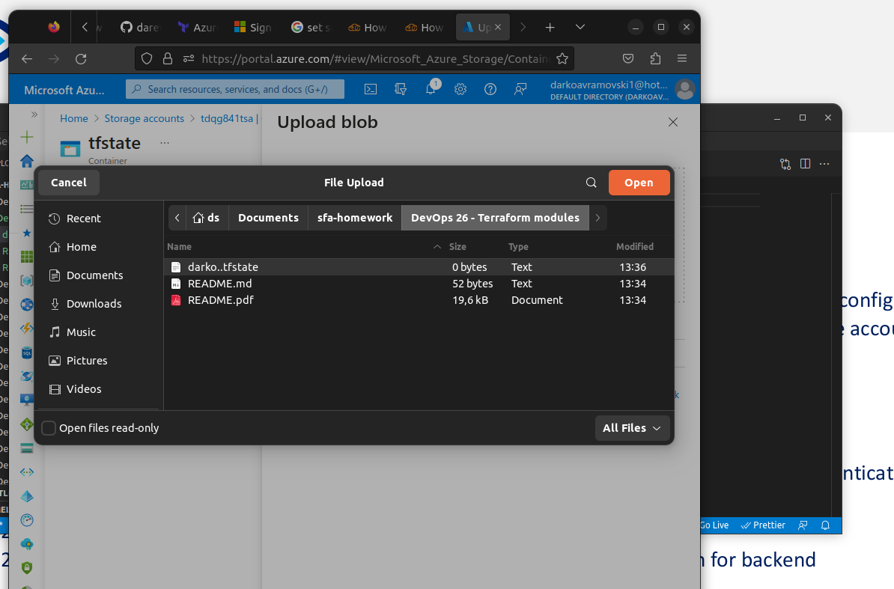

### Task 1: Setup and use remote terraform backend

1. In the previous exercise you have created code that creates a storage account. Now we will configure
and use that storage account as our backend for terraform. (if you have deleted that storage account,
just reapply your terraform code from your previous excercise

1.1. Create a Container in the storage account named “tfstate” with default settings.

   
   