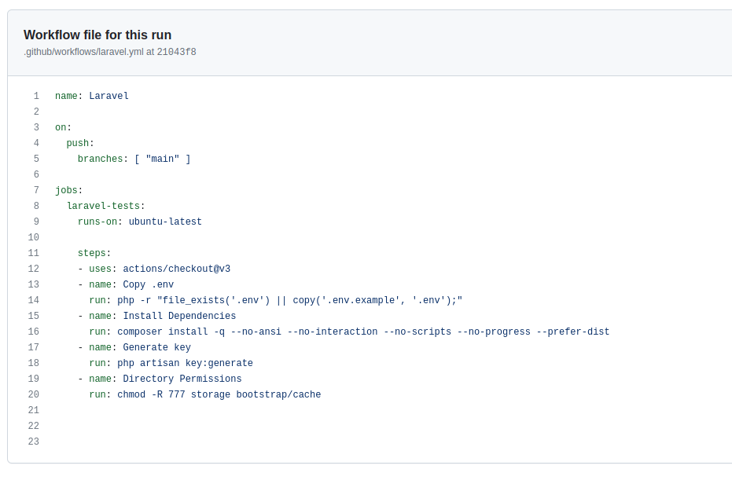
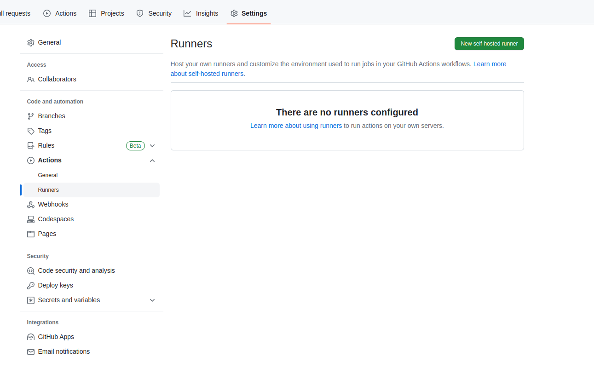

# GitHub Actions

1. First create new repository on github or use exiting repository. I created new instalation for laravel app, and push to github.
Then we are going to create new **github workflow** open you repository and navigate to ***actions*** and chooes you **workflow** based on application type.

Create workflow.yml file with the folowing content. Ad Commit directly to the **main** branch.

    name: Laravel

    on:
    push:
        branches: [ "main" ]

    jobs:
    laravel-tests:
        runs-on: ubuntu-latest

        steps:
        - uses: actions/checkout@v3
        - name: Copy .env
        run: php -r "file_exists('.env') || copy('.env.example', '.env');"
        - name: Install Dependencies
        run: composer install -q --no-ansi --no-interaction --no-scripts --no-progress --prefer-dist
        - name: Generate key
        run: php artisan key:generate
        - name: Directory Permissions
        run: chmod -R 777 storage bootstrap/cache

  

2. We have to **Create self-hosted runner** navigate to settings / actions  and click  Runners from left side menu, and than click on the button **New self-hosted runner** to create runner for the app.
