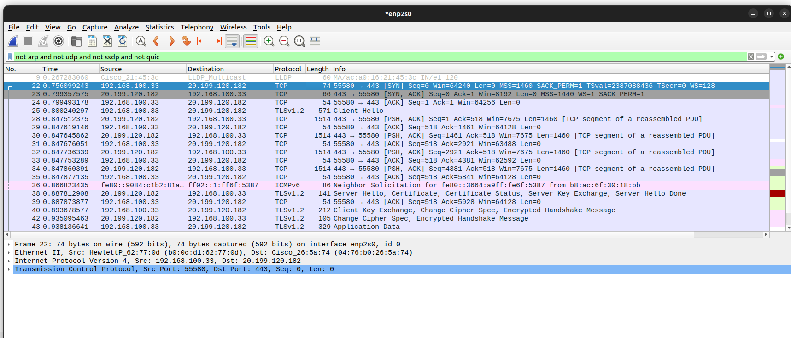
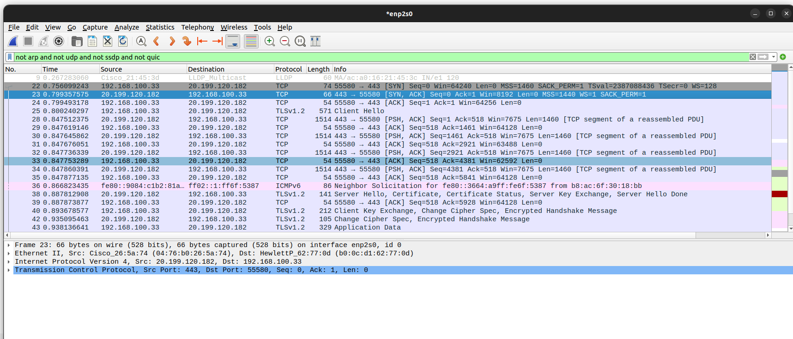
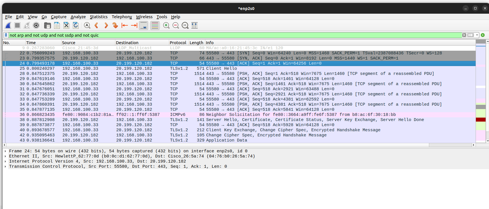
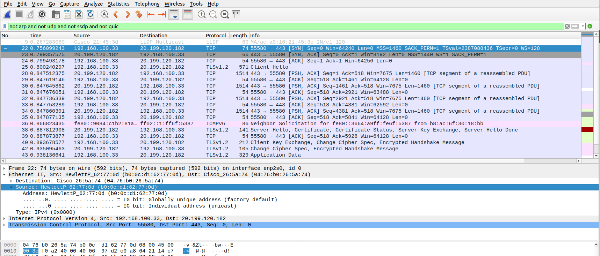
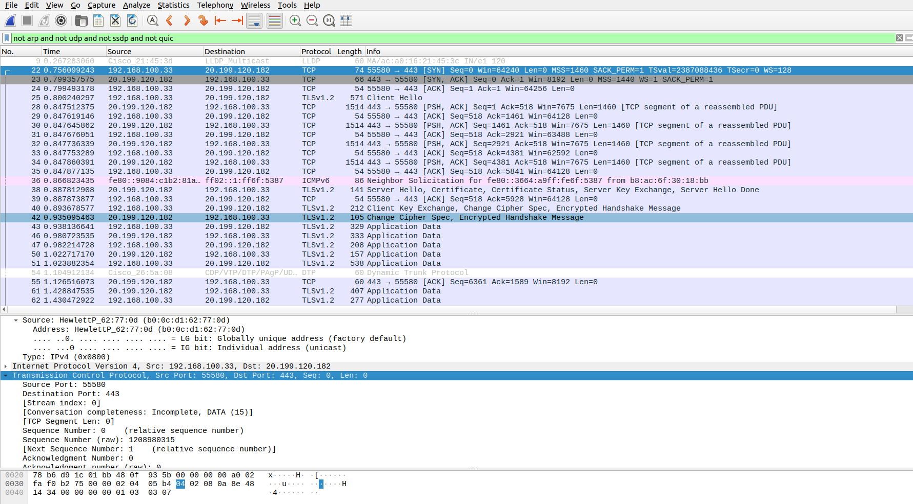
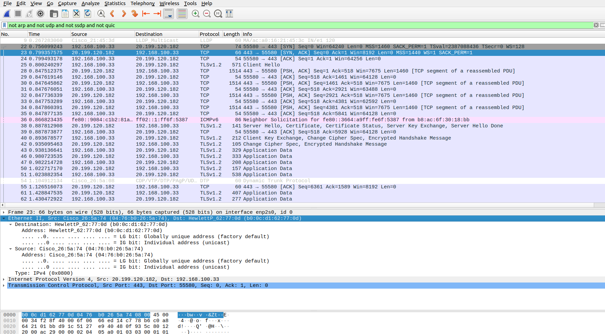

#### Exercise 1 – Basic network stuff

* **Easy Use the arp command and paste the output from the arp table on your system:**
  
  arp  - stands for Address resolution protocol is used to resolve ip address to to MAC addresess. MAC address is physical address of a device. Whenever a device needs to comunicate with another device on a local area network it needs MAC address for that device. arp stores MAC addreses in his local cache ARP cache. ARP Table is used to keep the record of the IP address and MAC address of the devices source and destination device for the communication between two devices

    **ds@ds-HP-ProBook-440-G6:~$ arp -a**

    <pre>

      ? (192.168.100.236) at 00:21:b7:2f:bf:4f [ether] on enp2s0   
      ? (192.168.100.149) at 00:21:b7:7e:d1:11 [ether] on enp2s0   
      ? (192.168.100.137) at 00:21:b7:d5:f2:e1 [ether] on enp2s0   
      ? (192.168.100.141) at 00:21:b7:d5:f2:b1 [ether] on enp2s0   
      70-100-168-192.dsl1-erie.roc.ny.frontiernet.net (192.168.100.70) at 58:20:b1:4e:bc:23 [ether] on enp2s0 
      ? (192.168.100.231) at e0:70:ea:f9:2c:10 [ether] on enp2s0 
      node-81s.pool-1-1.dynamic.totinternet.net (192.168.1.1) at 00:1f:33:28:81:80 [ether] on wlp0s20f3 
      ? (192.168.100.147) at 00:21:b7:e5:37:ce [ether] on enp2s0 
      ? (192.168.100.1) at 04:76:b0:26:5a:74 [ether] on enp2s0 
      nothing.attdns.com (192.168.100.135) at e0:70:ea:f9:2c:5a [ether] on enp2s0 
      ? (192.168.100.44) at e0:70:ea:f9:2c:b4 [ether] on enp2s0 
      ETH-240-ML3471ND.kultur.uni-hamburg.de (192.168.100.134) at 00:21:b7:d5:f6:c6 [ether] on enp2s0 
</pre>

* **Use the route command and paste the output from the routing table on your system:** 

      **ip route**   
    <pre>

      default via 192.168. 100.1 dev enp2s0 proto static metric 100 
      default via 192.168.1.1 dev wlp0s20f3 proto dhcp metric 600  
      169.254.0.0/16 dev wlp0s20f3 scope link metric 1000 
      192.168.1.0/24 dev wlp0s20f3 proto kernel scope link src 192.168.1.2 metric 600 
      192.168.100.0/24 dev enp2s0 proto kernel scope link src 192.168.100.33 metric 100
    
  </pre>

* **Use the traceroute command on your system and observe the hops to Google’s DNS, 8.8.8.8. Paste the full output from the command bellow showing all the hops from your system to 8.8.8.8.** 
  
  - traceroot is command line   
 
  **traceroute 8.8.8.8** 

    <pre>

         traceroute to 8.8.8.8 (8.8.8.8), 30 hops max, 60 byte packets
      1  192.168.100.1 (192.168.100.1)  1.097 ms  1.012 ms  0.960 ms 
      2  192.168.22.137 (192.168.22.137)  4.066 ms  4.105 ms  4.790 ms
      3  62.162.85.14 (62.162.85.14)  3.421 ms  3.759 ms  3.746 ms  
      4  62.162.85.13 (62.162.85.13)  6.402 ms  6.323 ms  2.673 ms 
      5  host-41.152.158.95.etisalat.com.eg (95.158.152.41)  4.961 ms  4.911 ms * 
      6  95.158.188.213 (95.158.188.213)  7.625 ms  9.867 ms  10.643 ms  
      7  ecs-1-92-251-142.compute.hwclouds-dns.com (142.251.92.1)  5.136 ms bras-base-mtrlpq427bw-grc-26-65-92-251-142.dsl.bell.ca (142.251.92.65)  6.197 ms ecs-1-92-251-142.compute.hwclouds-dns.com (142.251.92.1)  7.173 ms 
      8  209.85.243.245 (209.85.243.245)  4.727 ms 142.250.60.187 (142.250.60.187)  8.121 ms 108.170.236.33 (108.170.236.33)  9.257 ms 
      9  dns.google (8.8.8.8)  8.011 ms  7.957 ms  7.904 ms  
  </pre>

* **Why would you need to use the ping command?** 
  
    Answer:

    ping command is used to check connectivity betwen two hosts. 

  <pre>

      ds@ds-HP-ProBook-440-G6:~$ ping 8.8.8.8
      PING 8.8.8.8 (8.8.8.8) 56(84) bytes of data.
      64 bytes from 8.8.8.8: icmp_seq=1 ttl=116 time=7.82 ms
      64 bytes from 8.8.8.8: icmp_seq=2 ttl=116 time=8.13 ms
      64 bytes from 8.8.8.8: icmp_seq=3 ttl=116 time=7.75 ms
      64 bytes from 8.8.8.8: icmp_seq=4 ttl=116 time=7.76 ms
      64 bytes from 8.8.8.8: icmp_seq=5 ttl=116 time=7.72 ms
      64 bytes from 8.8.8.8: icmp_seq=6 ttl=116 time=7.79 ms
      64 bytes from 8.8.8.8: icmp_seq=7 ttl=116 time=7.49 ms

  
  </pre>

### Exercise 2 – TCP/IP Basics 
Refer to the exhibit and answer the questions below. The letter symbol ✉, represents the IP packet as it travels across the network. In the example shown, the laptop attempts to communicate with the web server in question. During its travel the packet will be forwarded across the network nodes and will eventually end up across six network interfaces before it reaches the web server. Each packet as part of the TCP/IP Stack contains fields for the source and destination MAC Address, IP Address and the TCP/UDP Port.

    1.	The laptop initiates communication with the web server and prepares a packet. What would the packet look like at this stage?
    	SRC IP    	100.20.30.10
    	DST IP    	80.70.60.100	
    	SRC MAC    	AA:AA:AA:33:33:33
    	DST MAC	BB:BB:BB:11:11:01

2.	RTR1 receives the packet on its IF-LAN interface, prepares it accordingly and forwards it out its IF- WAN. What would the packet look like at this stage?

    	SRC IP		100.20.30.10
    	DST IP		80.70.60.100
    	SRC MAC	BB:BB:BB:11:11:02
    	DST MAC	CC:CC:CC:22:22:02

3.	RTR2 receives the packet on its IF-WAN interface, prepares it accordingly and forwards it out via IF- LAN. What would the packet look like at this stage?

    	SRC IP		100.20.30.10
    	DST IP		80.70.60.100
    	SRC MAC	CC:CC:CC:22:22:01
    	DST MAC	DD:DD:DD:77:77:77
      

4.	The web server receives the packet and prepares a response packet back. What would the packet look like at this stage?

    	SRC IP		80.70.60.100
    	DST IP		100.20.30.10
    	SRC MAC	DD:DD:DD:77:77:77
    	DST MAC	CC:CC:CC:22:22:01

Since we are talking about web traffic (www) in the example, which transport layer protocol will most probably be used?

    	TCP
 

If we do a traffic analysis with a network packet monitoring tool like WireShark, what can we expect to see for the source and destination ports when the laptop sends the packet?

  •	SRC PORT:	
  •	DST PORT:	80 / 443 

Similarly, and vice versa, what can we expect to see as destination ports when the Web server sends a response packet back?

  •	SRC PORT:	80 / 443
  •	DST PORT:	

=======
* **Write down the TCP/UDP ports of the most commonly used services bellow in the form of TCP[PORT] or UDP[PORT].  As an example, the first two answers have been filled in:** 

  <pre>

    * HTTP – TCP80 
    * SNMP – UDP161 
    * HTTPS  443 port
    * DNS client - DNS uses port 53
    * DNS zone transfer - use TCP port 53
    * SMTP 
    * SSH -os using 22
    * FTP - os using 21
    * Telnet - 23 or 2323
    * MSSQL - 1433
    * MySQL - 3306
    * PostreSQL - 5432
    * RDP (Remote Desktop Protocol) - 3389
    * NTP  port 123 is used for NTP server communication and NTP clients use port 1023
    * NFS - 2049

  </pre>

* **Exercise 3 – Traffic analysis and identifying the OSI layers of the network packets** 

    Prerequisite: Search online and get familiar with the TCP’s three-way handshake. Learn how to capture the three way handshake using Wireshark. Install Wireshark on your computer and use it to capture traffic against a website or a server or your choice. It is recommended that you capture traffic against a simple website.  Name and the IP address of the website you plan to capture traffic: 

    Analyze the TCP’s three-way handshake and using screenshots from the Wireshark window answer the questions bellow: 

   
    
        

    

    
    

  <pre>
    
    1.What is the source IP (of the initiating host): 192.168.100.33
    2.What is the destination IP? (target website): 20.199.120.182
  </pre>

  Identify the Network Interface (Layer 1 & 2) section of the SYN packet and paste a screenshot from it: 

   

    

Identify the Network Layer 3 section of the SYN/ACK packet and paste a screenshot from it:  

Identify the Transport Layer 4 section of the ACK packet and paste a screenshot from it bellow: 

Look closely at the L2 section of the three-way handshake packet details. Each of them shows the source and destination MAC address of the packets.  Who is the owner of the destination MAC address of the SYN packet?