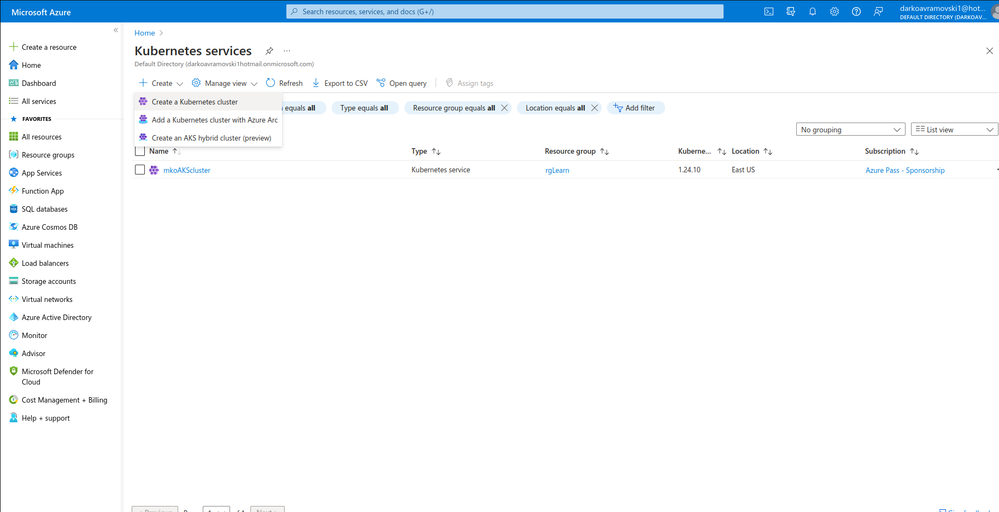

Exercise: PodsPods are the smallest, most basic deployable objects in Kubernetes. A Pod represents a single instance of a running process in your cluster. Pods contain one or more containers, such as Docker containers. Although you want deploy pods directly (static pods), knowledge for defining pods manifest files will be used for defining more complex Kubernetes resources like Controllers.

### Practice1: Simple pods operations

Login to your Azure portal and crete AKS cluster, navigate to Kubernetes services / Create Cluster

