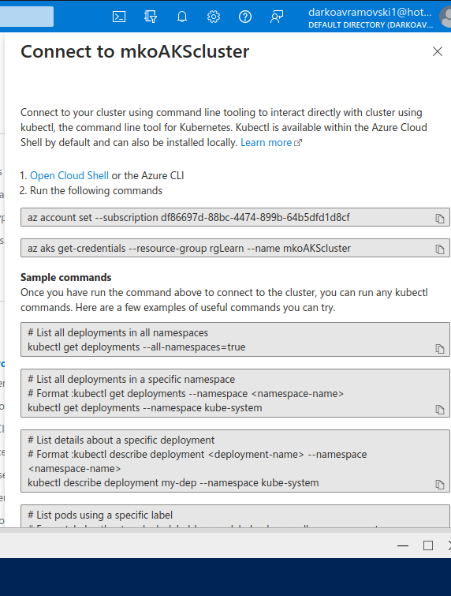

Exercise: PodsPods are the smallest, most basic deployable objects in Kubernetes. A Pod represents a single instance of a running process in your cluster. Pods contain one or more containers, such as Docker containers. Although you want deploy pods directly (static pods), knowledge for defining pods manifest files will be used for defining more complex Kubernetes resources like Controllers.

### Practice1: Simple pods operations

Login to your Azure portal and crete AKS cluster, navigate to Kubernetes services / Create Cluster

When we created the clusted we can connect to the cluster, click Connect new windows will popup on the right side of the screen there we have details how to connect to our cluster

Next open PowerShell and Run the following commands.

    az account set --subscription df86697d-88bc-4474-899b-64b5dfd1d8cf
    az aks get-credentials --resource-group rgLearn --name mkoAKScluster

check for active pods run command

**kubectl get pods**

We dont see any active pods

Now check all namespaces. Run .
    
**kubectl get pods –all-namespace**

How many pods do you see? Who deployed these pods? Why are they deployed? 

Now let`s deploy the first pod imperative approach. 

    kubectl run nginx --image=nginx

Now we can check for active pods. run command **kubectl get pods**

    kubectl get pods*

Now we can see logs from the pod we created in powershell type

    kubectl ngnix logs

To view the resources consumption **kubectl top pod nginx**

    kubectl top pod nginx

You can check the status of the nodes and list all pods of the kube-system namespace as follows:
    
    kubectl get pods -o wide

More detailed info about run **kubectl describe pod nginx**

    kubectl describe pod nginx

To delete the pod that i created run **kubectl delete pod nginx**

    kubectl delete pods nginx

Let’s find the image used on one of the corednspods under the kube-system namespace

    kubectl get pods --namespace kube-system

Once again list all pods under all namespaces.

    kubectl get pods --all-namespaces

Note one of the coredns pods. Now run kubectl describe pod <coredns-name> -n kube-system. Replace the <coredns-name> place holder with noted name.

    kubectl describe pod coredns-59b6bf8b4f-dgrg2  --namespace kube-system

### Practice2: Working with pod manifest files

Now it is time to deploy pod using manifest file (declarative approach). Copy the following code block on your local computer in a file called redis.yaml:

Connect to your cluster, and upload the file that you created redis.yaml and runn **kubectl create -f redis.yaml** fix the erros that you got in redis.yaml and run again the same command.

        apiVersion: v1
        kind: Pod
        metadata:
        name: static-web
        labels:
            role: myrole
        spec:
        containers:
            - name: redis
            image: redis123

The pod is not running

Check the events associated with this pod. Run the kubectl describe pod static-web command. What are the events showing? Why your pod is not running?
we get following error
***pull access denied, repository does not exist or may require authorization: server message: insufficient_scope: authorization failed***

Find the correct image (check the Docker hub page) and correct it in the manifest.Locate the image information and put the correct image name. Redeploy the pod (fist run kubectl delete pod static-web to delete the pod, then run kubectl create once again).

Fix the erros in redis.yaml file upload and run again **kubectl create -f redis.yaml**

Now you can delete the pod. Try to delete it using the kubectl delete –f redis.yaml.

    kubectl delete –f redis.yaml.

Your next task is to create and test nginx pod definition. Your definition should use the nginx official image, should use label named app with valuefrontend  and should publish port 80. Make sure you complete this task because we will use this template in our next Labs. Your nginx pod should be running without any issues.

### Practice3: Multi-container pods

Once finished you can try to create multi-container pod definition. Your multi-container pod should use redis and nginx containers with port 6379 and 80 published respectively. Label name should be app with value web.

Note that in reality there is no sense to put the redis and nginx under the same pod but it can be done for the purpose of learning.

    kubectl create -f nginx.yaml  

Verify deployments

Delete all the pods under the default namespace. 
Don’t delete any of the manifest files you have created so far.

### Practice4: Probes

First we will create and test liveness probe with exec test. 
Create a file named probes_exec.yaml with following content: