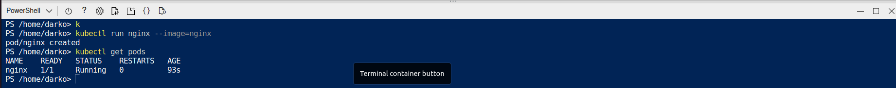

Exercise: PodsPods are the smallest, most basic deployable objects in Kubernetes. A Pod represents a single instance of a running process in your cluster. Pods contain one or more containers, such as Docker containers. Although you want deploy pods directly (static pods), knowledge for defining pods manifest files will be used for defining more complex Kubernetes resources like Controllers.

### Practice1: Simple pods operations

Login to your Azure portal and crete AKS cluster, navigate to Kubernetes services / Create Cluster

When we created the clusted we can connect to the cluster, click Connect new windows will popup on the right side of the screen there we have details how to connect to our cluster

Next open PowerShell and Run the following commands.

    az account set --subscription df86697d-88bc-4474-899b-64b5dfd1d8cf
    az aks get-credentials --resource-group rgLearn --name mkoAKScluster

check for active pods run command

**kubectl get pods**

We dont see any active pods

Now check all namespaces. Run .
    
**kubectl get pods –all-namespace**

How many pods do you see? Who deployed these pods? Why are they deployed? 

Now let`s deploy the first pod imperative approach. 

    kubectl run nginx --image=nginx

Now we can check for active pods. run command **kubectl get pods**

    kubectl get pods*

Now we can see logs from the pod we created in powershell type

    kubectl ngnix logs

To view the resources consumption **kubectl top pod nginx**

    kubectl top pod nginx

To see any scheduled pods run:
    
    kubectl get pods -o wide

More detailed info about run **kubectl describe pod nginx**

    kubectl describe pod nginx

