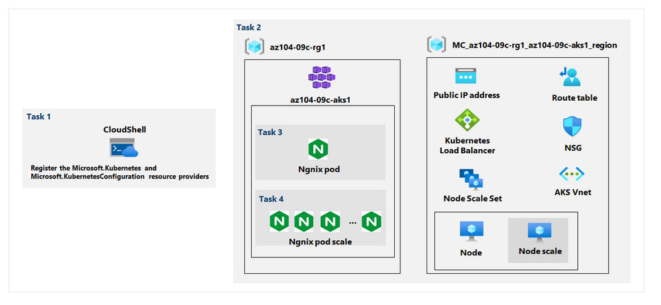

## Implement Azure Kubernetes Service

### Lab scenario

Contoso has a number of multi-tier applications that are not suitable to run by using Azure Container Instances. In order to determine whether they can be run as containerized workloads, you want to evaluate using Kubernetes as the container orchestrator. To further minimize management overhead, you want to test Azure Kubernetes Service, including its simplified deployment experience and scaling capabilities.

In this lab, you will:

Task 1: Register the Microsoft.Kubernetes and Microsoft.KubernetesConfiguration resource providers.

Task 2: Deploy an Azure Kubernetes Service cluster

Task 3: Deploy pods into the Azure Kubernetes Service cluster

Task 4: Scale containerized workloads in the Azure Kubernetes service cluster

Exercise 1