## Implement Traffic Management Student

In this lab,
<ul>
     <li>Task 1: Provision the lab environment</li>
     <li>Task 2: Configure the hub and spoke network topology</li>
     <li>Task 3: Test transitivity of virtual network peering</li>
     <li>Task 4: Configure routing in the hub and spoke topology</li>
     <li>Task 5: Implement Azure Load Balancer</li>
     <li>Task 6: Implement Azure Application Gateway</li>
</ul>

### Task 1: Provision the lab environment

#### Login to portal.azure. Open powershell and upload two files 

File 1: **\Allfiles\Labs\06\az104-06-vms-loop-template.json**
  

File 2: **\Allfiles\Labs\06\az104-06-vms-loop-template.json**

After we upload the scripts, we have to edit the login credentials.

#### From the powershell run this command to create three virtual networks and four Azure VMs from files we uploaded.

    New-AzResourceGroupDeployment `
    -ResourceGroupName $rgName `
    -TemplateFile $HOME/az104-06-vms-loop-template.json `
    -TemplateParameterFile $HOME/az104-06-vms-loop-parameters.json

#### Success!!! We created new VM

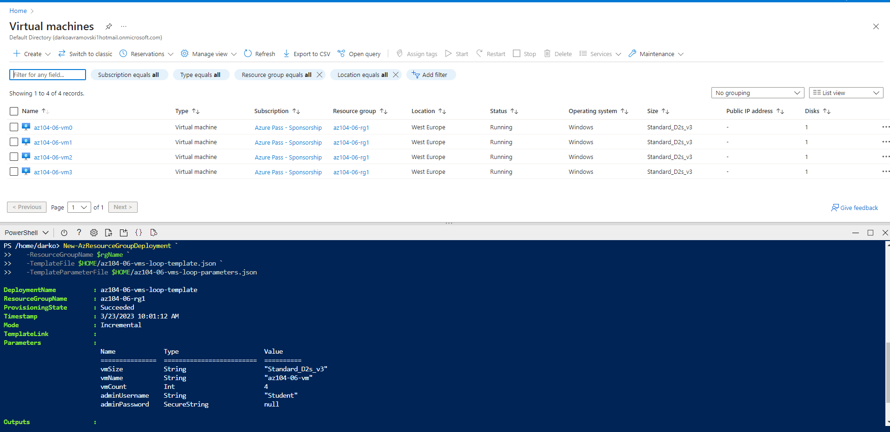

### Now we have to create Network Watcher extension on the Azure, for the vm we created in previous step. Run this command in powershell
#### Success!!! We created new network watche for every VM
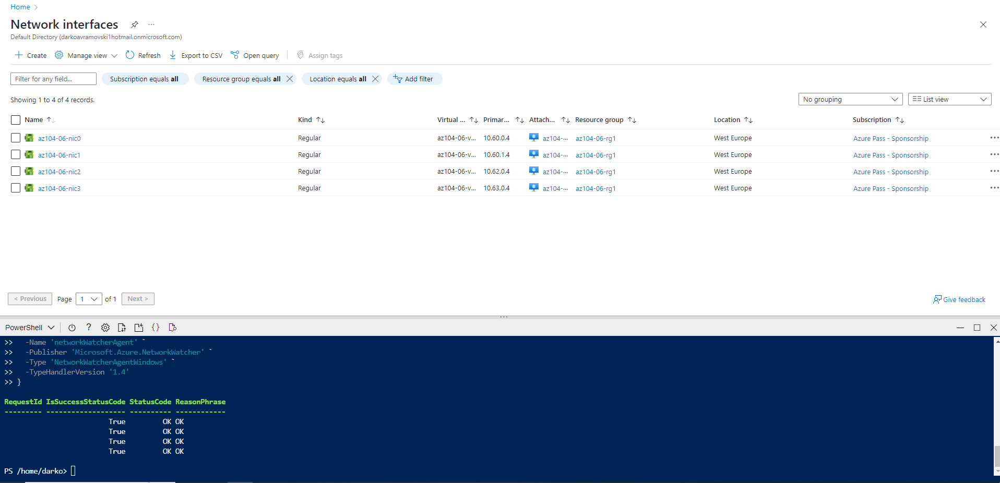

### Task 2: Configure the hub and spoke network topology

From the search bar type Virtual networks. Select **az104-06-vnet2** / Properties from left side menu .  and copy **Resource ID** also for **az104-06-vnet3**.

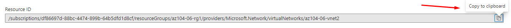

Select **az104-06-vnet01**  and from left side menu select **Peerings** than click Add new 
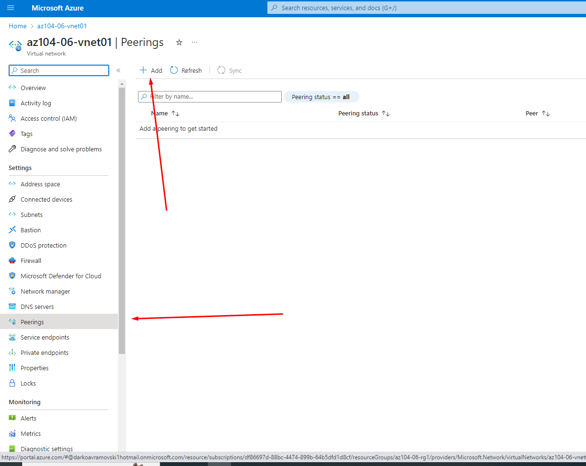

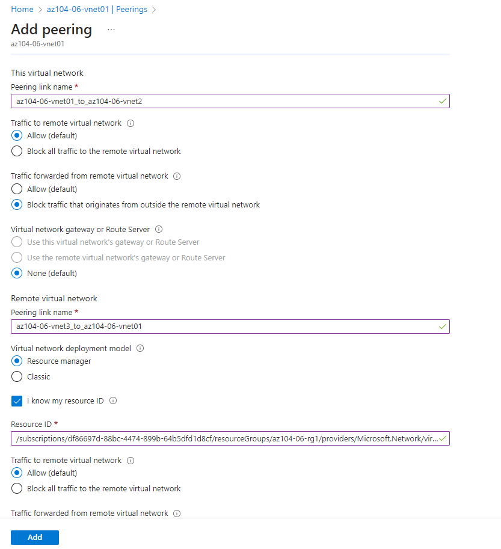

### Repeat this proces for az104-06-vnet3

### Task 4: Configure routing in the hub and spoke topology

We have to enable **IP forwading** on VM **az104-06-vm0** we have to go in Virtual Machines/az104-06-vm0/Network Interface: az104-06-nic0 enable **IP forwading** and click Save

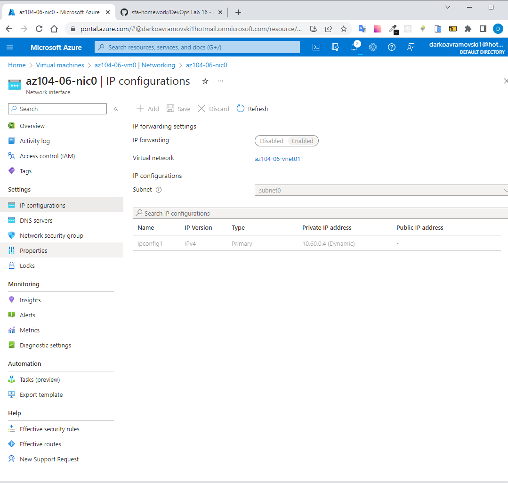

Navigate back to Virtual Machines and select  **az104-06-vm0** and click **Overview** and **Run command** and select **RunPowerShellScript.**
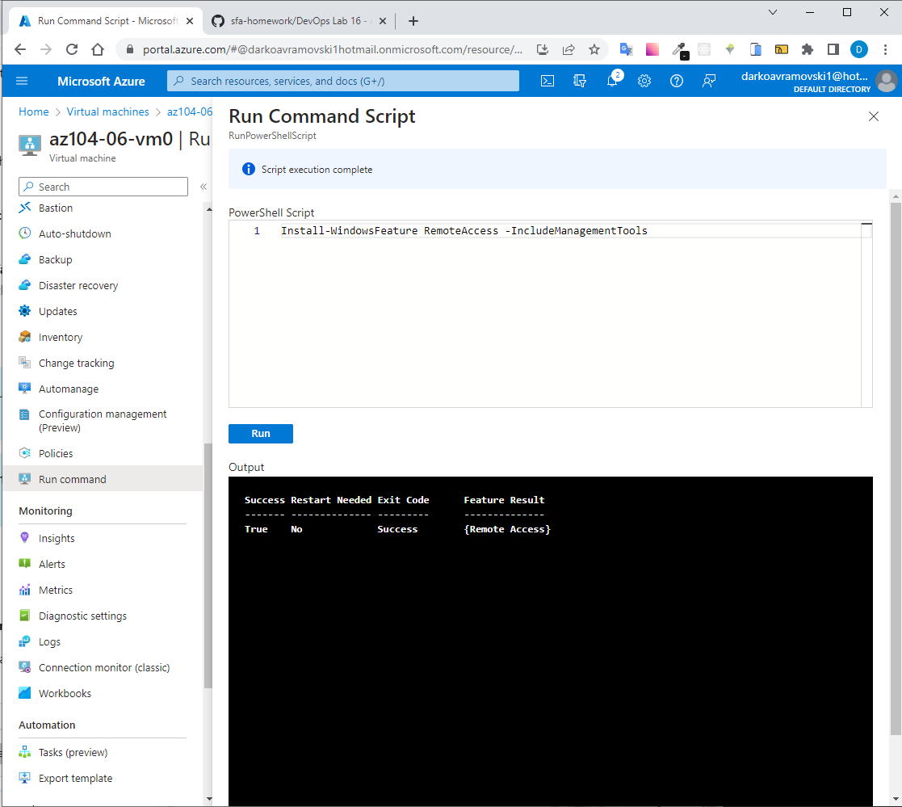

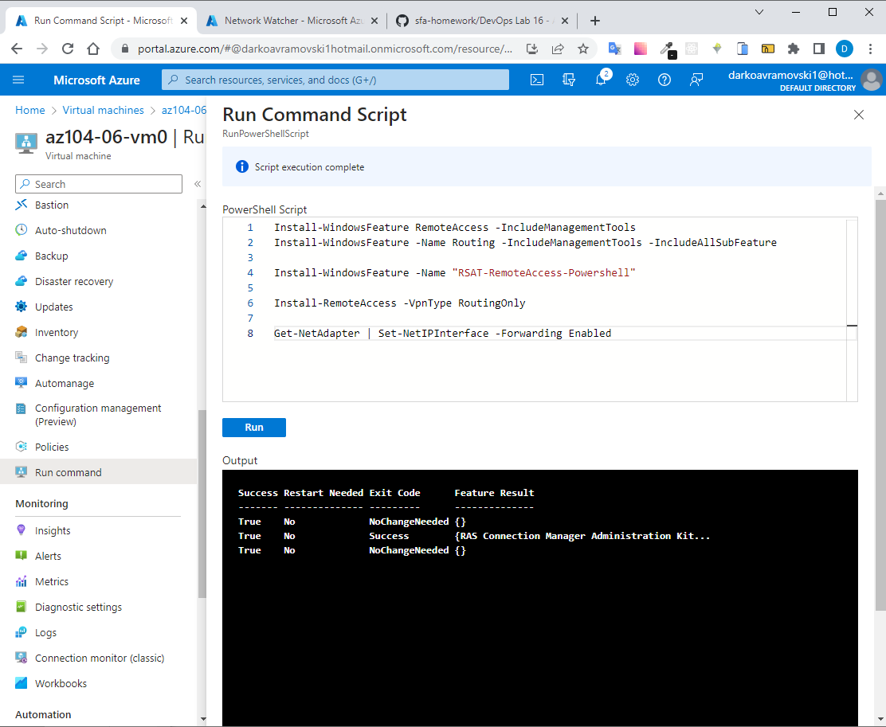

Now we have to create route tables

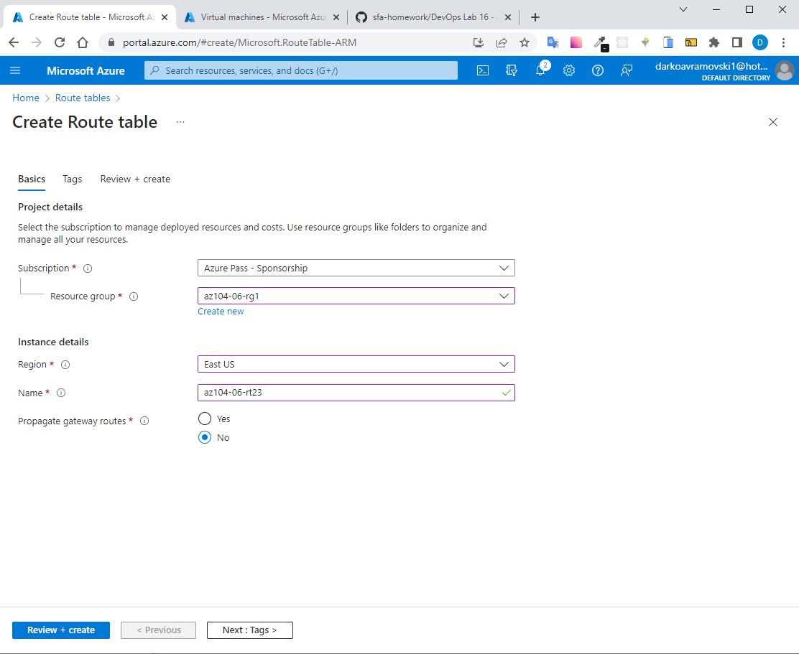
Click got to resources
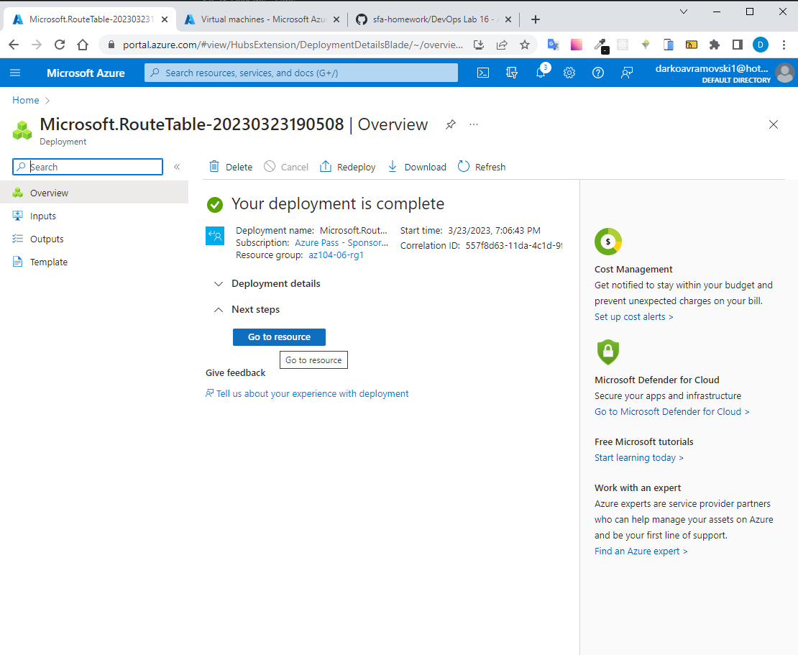
Now we have to add Routes 

Create subnet
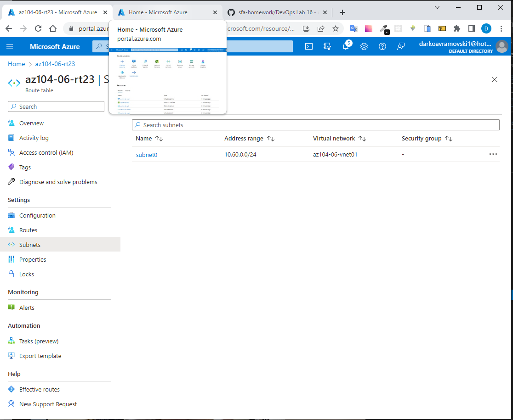
