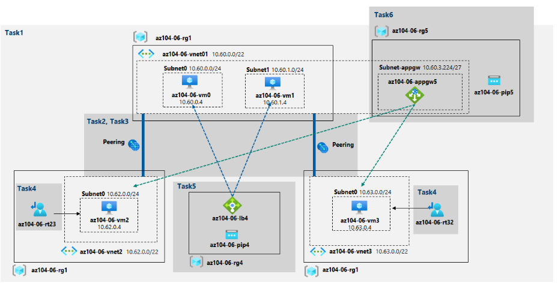
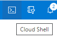
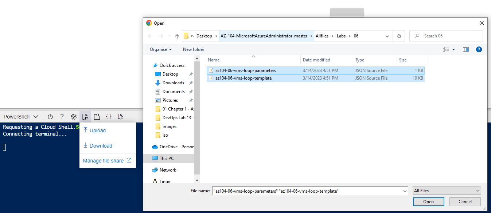
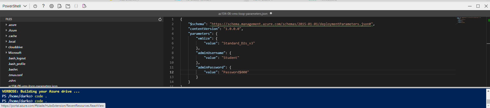

## Implement Traffic Management Student

In this lab,
<ul>
     <li>Task 1: Provision the lab environment</li>
     <li>Task 2: Configure the hub and spoke network topology</li>
     <li>Task 3: Test transitivity of virtual network peering</li>
     <li>Task 4: Configure routing in the hub and spoke topology</li>
     <li>Task 5: Implement Azure Load Balancer</li>
     <li>Task 6: Implement Azure Application Gateway</li>
</ul>

Login to portal.azure. Open powershell and upload two files 

File 1: **\Allfiles\Labs\06\az104-06-vms-loop-template.json**
  

File 2: **\Allfiles\Labs\06\az104-06-vms-loop-template.json**

After we upload the scripts, we have to edit the login credentials.

From the powershell run this command to create three virtual networks and four Azure VMs from files we uploaded.

    New-AzResourceGroupDeployment `
    -ResourceGroupName $rgName `
    -TemplateFile $HOME/az104-06-vms-loop-template.json `
    -TemplateParameterFile $HOME/az104-06-vms-loop-parameters.json