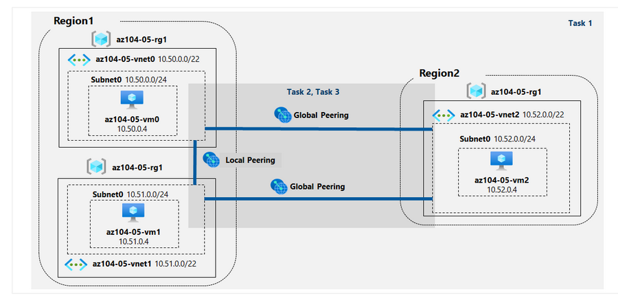
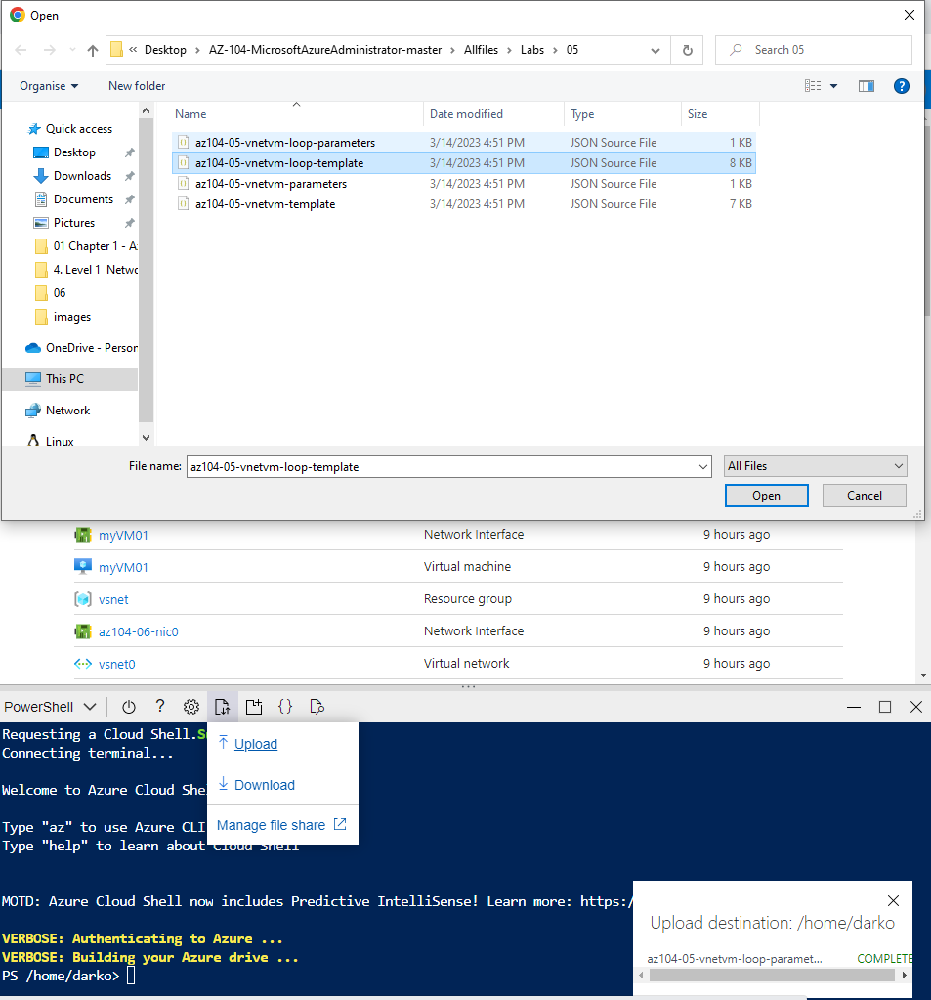

## Implement Intersite Connectivity Student 

### In this lab, you will:

<ul>
    <li>Task 1: Provision the lab environment</li>
    <li>Task 2: Configure local and global virtual network peering</li>
    <li>Task 3: Test intersite connectivity</li>
</ul>

In the Azure portal, open the Azure Cloud Shell

Using powershell upload the files

 

**az104-05-vnetvm-loop-template.json**

 

**az104-05-vnetvm-loop-parameters.json**

In the powershell type **code .** and vscode will be open in powershell terminal. Edit password, type secure password **az104-05-vnetvm-loop-parameters.json** and save the file.

We have to create new resource group that will be hosting the lab environment. The first two virtual networks and a pair of virtual machines will be deployed in azure region 1, The third virtual network and the third virtual machine will be deployed in the same resource group but another azure region 2.  

From the powershell run this commands to create new location and resource group

        $location1 = 'eastus'

        $location2 = 'westus'

        $rgName = 'az104-05-rg1'

        New-AzResourceGroup -Name $rgName -Location $location1

Then we have to create three virtual networks and deploy VM into then by using templates, run this command in powershell

         New-AzResourceGroupDeployment `
        -ResourceGroupName $rgName `
        -TemplateFile $HOME/az104-05-vnetvm-loop-template.json `
        -TemplateParameterFile $HOME/az104-05-vnetvm-loop-parameters.json `
        -location1 $location1 `
        -location2 $location2