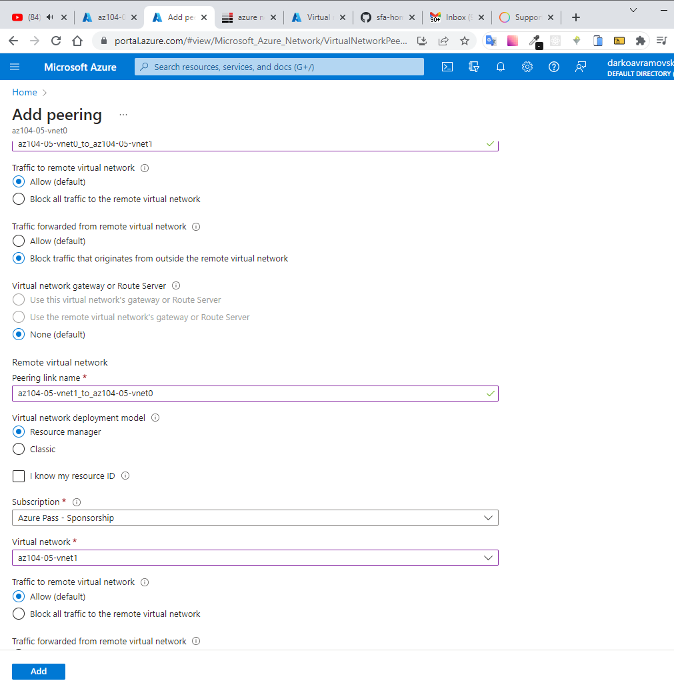

## Implement Intersite Connectivity Student 

### In this lab, you will:

<ul>
    <li>Task 1: Provision the lab environment</li>
    <li>Task 2: Configure local and global virtual network peering</li>
    <li>Task 3: Test intersite connectivity</li>
</ul>

In the Azure portal, open the Azure Cloud Shell

Using powershell upload the files

 

**az104-05-vnetvm-loop-template.json**

 

**az104-05-vnetvm-loop-parameters.json**

In the powershell type **code .** and vscode will be open in powershell terminal. Edit password, type secure password **az104-05-vnetvm-loop-parameters.json** and save the file.

We have to create new resource group that will be hosting the lab environment. The first two virtual networks and a pair of virtual machines will be deployed in azure region 1, The third virtual network and the third virtual machine will be deployed in the same resource group but another azure region 2.  

From the powershell run this commands to create new location and resource group

        $location1 = 'eastus'

        $location2 = 'westus'

        $rgName = 'az104-05-rg1'

        New-AzResourceGroup -Name $rgName -Location $location1

Then we have to create three virtual networks and deploy VM into then by using templates, run this command in powershell

         New-AzResourceGroupDeployment `
        -ResourceGroupName $rgName `
        -TemplateFile $HOME/az104-05-vnetvm-loop-template.json `
        -TemplateParameterFile $HOME/az104-05-vnetvm-loop-parameters.json `
        -location1 $location1 `
        -location2 $location2

After deployment has finished we have to configure local and global virtual network peering

In the list of virtual networks, click **az104-05-vnet0.**

On the **az104-05-vnet0** virtual network blade, in the Settings section, click **Peerings** and then click **+ Add.**

    This step establishes two local peerings - one from az104-05-vnet0 to az104-05-vnet1 and the other from az104-05-vnet1 to az104-05-vnet0.

#### Repeat this step with virtual networka - az104-05-vnet2

Next open VM **az104-05-vm0** and connect with RDP

Open powershell run the following to test connectivity to az104-05-vm1

    Test-NetConnection -ComputerName 10.51.0.4 -Port 3389 -InformationLevel 'Detailed'

In the Windows PowerShell console window, run the following to test connectivity to az104-05-vm2 

    Test-NetConnection -ComputerName 10.52.0.4 -Port 3389 -InformationLevel 'Detailed'

#### Switch back to the Azure portal on your lab computer and navigate back to the Virtual machines blade.
In the list of virtual machines, click az104-05-vm1. and connect via RDP  and open PowerShell as admin, run the command to test connectivity to **az104-05-vm2** (which has the private IP address of 10.52.0.4) over TCP port 3389:

