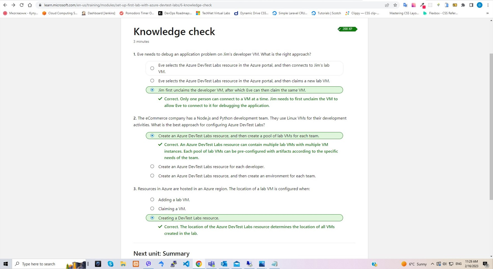

# DevTest Labs

## Azure DevTest Labs

In this lab we have to setup our first development lab by using azure DevTest labs. In this module, we have to configure a standardized development lab and pre-configure it with software components. After we finish with depyoment, we can connect using RDP and SSH

## Knowledge check

