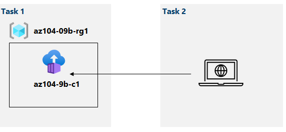

## Implement Azure Container Instances 

Link from Lab [Docker](https://microsoftlearning.github.io/AZ-104-MicrosoftAzureAdministrator/Instructions/Labs/LAB_09b-Implement_Azure_Container_Instances.html).

### Lab scenario

Contoso wants to find a new platform for its virtualized workloads. You identified a number of container images that can be leveraged to accomplish this objective. Since you want to minimize container management, you plan to evaluate the use of Azure Container Instances for deployment of Docker images.

In this lab, you will:

Task 1: Deploy a Docker image by using the Azure Container Instance
Task 2: Review the functionality of the Azure Container Instance

Task 1: Deploy a Docker image by using the Azure Container Instance

 
