### Exercise: Storage

#### Practice 1: Direct provisioning of Azure File storage

1. Login to Azure and connect to your AKS cluster.
2. Check if any pods run under the default namespace if so delete everything under the default namespace. 
3. 3.In this practice we will directly provision Azure Files to a pod running inside AKS.4
4. First create the Azure Files share. Run the following commands:

First connect your azure clusster, using this commands

    az account set --subscription df86697d-88bc-4474-899b-64b5dfd1d8cf
    az aks get-credentials --resource-group rgLearn --name mkoAKS

## Create a resource group

    AKS_PERS_STORAGE_ACCOUNT_NAME=aksstorage1227
    AKS_PERS_RESOURCE_GROUP=rgLearn1227
    AKS_PERS_LOCATION="eastus"
    AKS_PERS_SHARE_NAME=1227aksshare
    
    az group create --name $AKS_PERS_RESOURCE_GROUP --location $AKS_PERS_LOCATION

### Create a storage account

    az storage account create -n $AKS_PERS_STORAGE_ACCOUNT_NAME -g $AKS_PERS_RESOURCE_GROUP -l $AKS_PERS_LOCATION --sku Standard_LRS

### Export the connection string as an environment variable, this is used when creating the Azure file share

    az storage account create -n $AKS_PERS_STORAGE_ACCOUNT_NAME -g $AKS_PERS_RESOURCE_GROUP -l $AKS_PERS_LOCATION --sku Standard_LRS

    
### Export the connection string as an environment variable, this is used when creating the Azure file shareexport 

    export AZURE_STORAGE_CONNECTION_STRING=$(az storage account show-connection-string -n $AKS_PERS_STORAGE_ACCOUNT_NAME -g $AKS_PERS_RESOURCE_GROUP -otsv)

### Create the file share

    az storage share create -n$AKS_PERS_SHARE_NAME --connection-string$AZURE_STORAGE_CONNECTION_STRING

### Get storage account key

    STORAGE_KEY=$(az storage account keys list --resource-group $AKS_PERS_RESOURCE_GROUP --account-name $AKS_PERS_STORAGE_ACCOUNT_NAME --query [0].value -otsv)

### Echo storage account name and key 

    echo Storage account name: $AKS_PERS_STORAGE_ACCOUNT_NAME
    echo Storage account key: $STORAGE_KEY

5. Make a note of the storage account name and key shown at the end of the script output. These values are
needed when you create the Kubernetes volume in one of the following steps.

6. Now we will need to create a Kubernetes secret that will be used to mount the Az File Share to the pod. You
need to hide this information from the pod’s definition and K8S secret is the best way to do it.

7. Run the following (single) command to create the secret

Create secret using this command

    kubectl create secret generic azure-secret --from-literal=aksstorage1227=$AKS_PERS_STORAGE_ACCOUNT_NAME --from-literal=LdZz/dov9WiXe/NGeLUzls6CN8mT4lYbXEpNAc2yejsfEg53LBKnW7tGtLXcAmG9gGNCAEDDYc+k+AStQR7TYQ===$STORAGE_KEY

Check if secret was created. 
    
    Run kubectl get secret -A.

After we created secret we can create the yaml file **azure-files-pod.yaml.**

Upload newly created file and run to create new pod:

    kubectl apply -f azure-files-pod.yaml. 

You can use kubectl describe pod mypod to verify the share is mounted successfully.

## Practice 2: Provisioning Azure File storage using PVs and PVCs

1. Login to Azure and connect to your AKS cluster.
2. Check if any pods run under the default namespace if so delete everything under the default namespace.
3. Now we will provision Azure files storage to a pod using PV and PVC.
4. Create a azurefile-mount-options-pv.yaml file with a PersistentVolume like this:

Lets create new zurefile-mount-options-pv.yaml PersistentVolume and upload 

    kubectl apply -f azurefile-mount-options-pv.yaml 

5. Note the access mode. Can you use other mode with Azure files?
6. Now create a azurefile-mount-options-pvc.yaml file with a PersistentVolumeClaim that uses the
PersistentVolume like this:

    kubectl apply -f azurefile-mount-options-pv.yaml

Mount the PersistentVolumeClaim

Verify your PersistentVolumeClaim is created and bound to the PersistentVolume. 
Run:
     kubectl get pvc azurefile.

Now we can embed the PVC info inside our pod definition. Create the following file azure-files-pod.yaml with
following content:

    kubectl apply -f azure-files-pod.yaml.

    kubectl describe pod mypod

## Practice 3: Provisioning Azure file storage using Storage Classes

2. Check if any pods run under the default namespace if so delete everything under the default namespace.
3. Now we will provision file storage using the definition of storage classes. Create a file named azure-file-sc.yaml
and copy in the following example manifest:

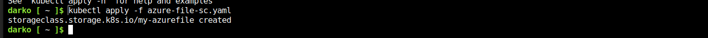

    kubectl apply -f azure-file-sc.yaml

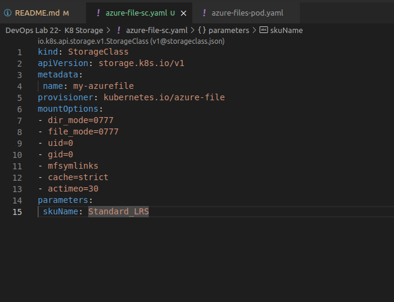

Now we will create the PVC that will consume the storage class defined previously. Create a file named azure-
file-pvc.yaml and copy in the following YAML

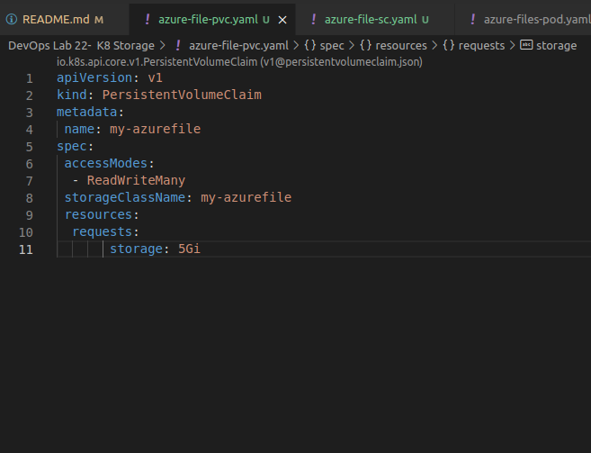

    kubectl apply -f azure-file-pvc.yaml

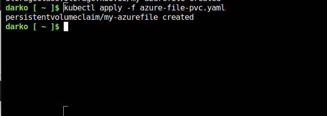

Once completed, the file share will be created. A Kubernetes secret is also created that includes connection
information and credentials. You can use the kubectl get pvc my-azurefile command to view the status of the
PVC.

    kubectl get pvc my-azurefile

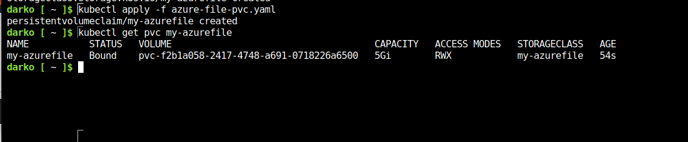

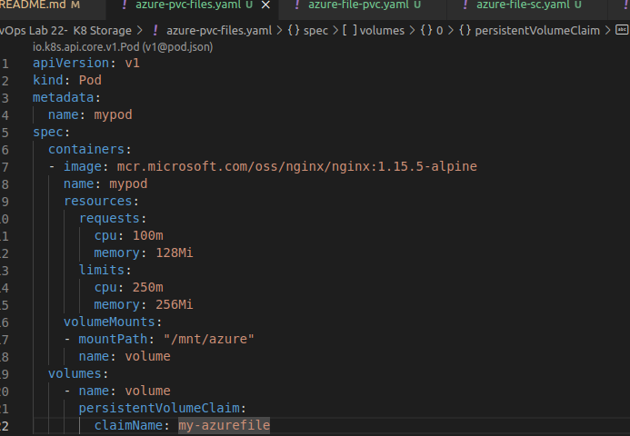

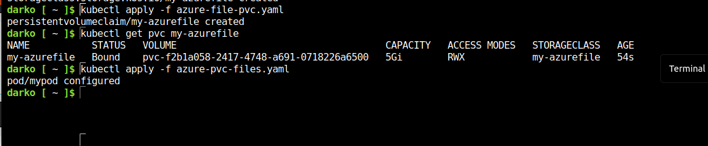

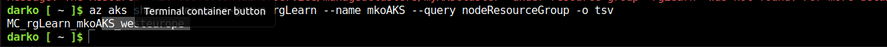

9. Create the pod with kubectl apply -f azure-pvc-files.yaml .
10. Do a describe on the pod and check the volumes mounted.
11. Delete everything created under this practice including the storage class.

## Practice 4: Direct provisioning of Azure Disk storage

2. Check if any pods run under the default namespace if so delete everything under the default namespace.
3. In this practice we will directly provision Azure Disk to a pod running inside AKS.
4. First create the disk in the node resource group. First, get the node resource group name with az aks show --
resource-group myResourceGroup --name myAKSCluster --query nodeResourceGroup -o tsv .
5. Now create a disk using:

    az aks show --resource-group rgLearn --name mkoAKS --query nodeResourceGroup -o tsv

        az disk create \
    --resource-group MC_myResourceGroup_myAKSCluster_eastus \
    --name myAKSDisk \
    --size-gb 20 \
    --query id --output tsv

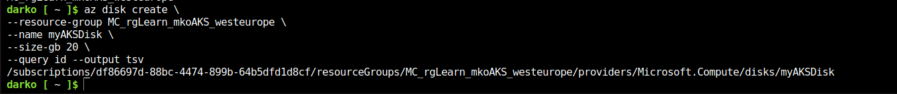

Run kubectl apply -f azure-disk-pod.yaml.
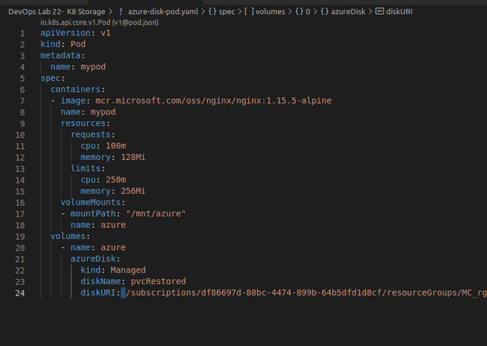

You can use kubectl describe pod mypod to verify the share is mounted successfully. Search for the Volumes section of the output.

    kubectl describe pod mypod 

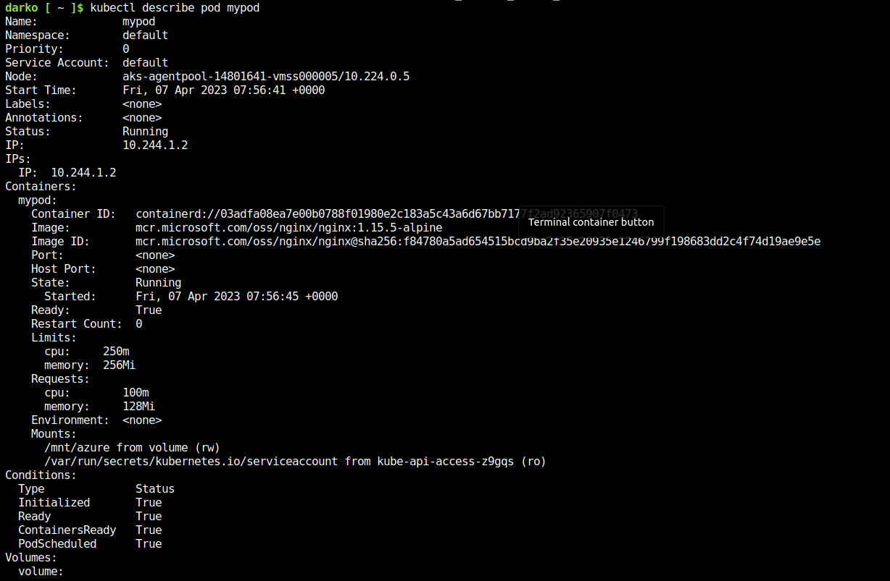

Run the following command kubectl exec -it mypod -- bash

Go to /mnt/azure and try create a blank file test.txt file.

Delete everything created by this practice.

## Practice 5: Provisioning Azure Disk storage using Storage Classes

1. Login to Azure and connect to your AKS cluster.
2. Check if any pods run under the default namespace if so delete everything under the default namespace.
3. Now we will provision Azure disk and attach it to a running pod but this time using dynamic provisioning with
storage classes. List the available storage classes, run kubectl get sc.
4. Examine the output. Each AKS cluster includes four pre-created storage classes, two of them configured to
work with Azure disks, default and managed-premium. We will use the managed-premium in our PVC
definition since it uses premium type of disks.
5. Now we will create the PVC that will consume the storage class defined previously. Create a file named azure- premium.yaml and copy in the following YAM

6. Create the persistent volume claim with the kubectl apply -f azure-premium.yaml.
7. Check the status of your PVC.
8. Now we will create the pod that consumes the PVC. Create a file named azure-pvc-disk.yaml, and copy in the following YAML. Make sure that the claimName matches the PVC created in the last step:

List the available storage classes, run kubectl get sc.

    kubectl get sc

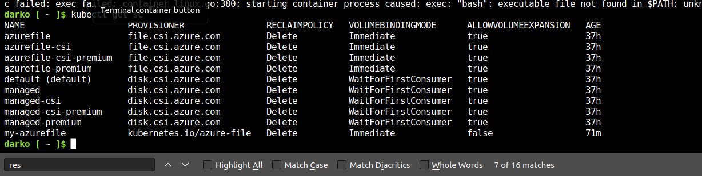

now create new file named azure-premium.yaml
    
    kubectl apply -f azure-premium.yaml 

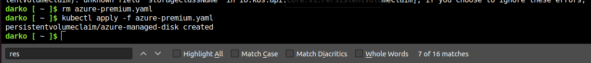

Now we will create the pod that consumes the PVC. Create a file named azure-pvc-disk.yaml, and copy in the following YAML. Make sure that the claimName matches the PVC created in the last step:

azure-pvc-disk.yaml

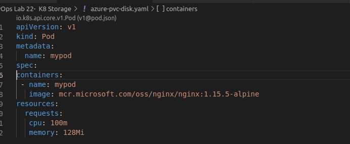

9. Create the pod with kubectl apply -f azure-pvc-disk.yaml .
10. Do a describe on the pod and check the volumes mounted.
11. Delete everything created under this practice including the storage class.