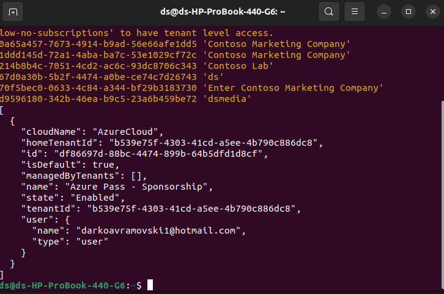
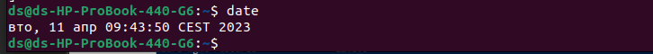
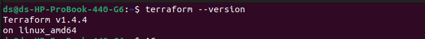
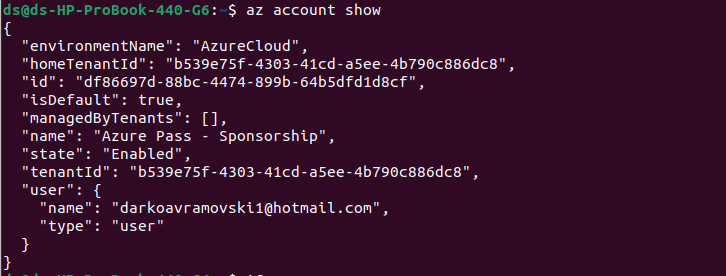

## Task 1: Install terraform and Azure CLI

1. Use official guidelines to install the latest version of terraform and Azure CLI 

    Install **Terraform and Azure CLI**

2. Authenticate with Azure CLI 
   
   az login

3. Set the exercise subscription as default for Azure CLI
4. Provide console print screen:
   
    
   
4.1  Time and date when the exercise was worked
n the console type ***date***
    

4.2 Output of the terraform command that will print out the Terraform version installed
To see terraform version type

    terraform --version 
    
    Terraform v1.4.4 on linux_amd64

4.3 Azure CLI output of the current subscription

    az version

    {
    "environmentName": "AzureCloud",
    "homeTenantId": "b539e75f-4303-41cd-a5ee-4b790c886dc8",
    "id": "df86697d-88bc-4474-899b-64b5dfd1d8cf",
    "isDefault": true,
    "managedByTenants": [],
    "name": "Azure Pass - Sponsorship",
    "state": "Enabled",
    "tenantId": "b539e75f-4303-41cd-a5ee-4b790c886dc8",
    "user": {
        "name": "darkoavramovski1@hotmail.com",
        "type": "user"
    }
    }

 
 ## Task 2: Define your first terraform infrastructure code
