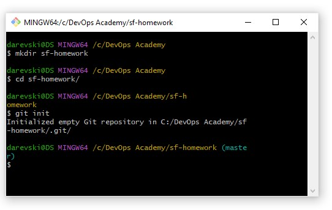

# Git & GitHub

Git is a free and open source distributed version control system.

## Instalation git

For Instalation [Click here to download](https://git-scm.com/downloads)

## Create Profile on GitHub

Link to [GitHub ](https://git-scm.com/downloads)

#### 1. Create repository in GitHub

From top main navigation click on plus icon and from dropdown menu chooese New Repository 

#### 2. Type repository name sf-homework

 

#### 3. Choose a repository visibility - Private or Public

#### 4. Add README.md file \* optional or leave it as it is

#### 5. Add .gitignore \* optional or leave it as it is

#### 6. Choose a license \* optional or leave it as it is

### 7. Click CREATE REPOSITORY

 

## Cloning

You can clone your repository to create a local copy on your computer and sync between the two locations.
Open your repository.

## Create a new repo from scratch and connect to github.

Open your terminal in desire location and create folder

    mkdir sf-homework

    cd sf-homework

    git init

---

    create README.md file
    git add . too add all files in working directory or use git add file1 file2
    git commit -m "inital push" // write commit message
    git branch -M main
    git remote add origin https://github.com/username/sf-homework.git
    git push -u origin main

---
