# Exercise: Basic Linux & Bash commands 

## Exercise 01

### Create a file friends.txt with a list of names of three of your friends on separate lines. 

* Lets create new file using nano - text editor, open Terminal and type:

        $ nano friends.txt

* Alternativy you can create new file using touch command

		$ touch friends.txt

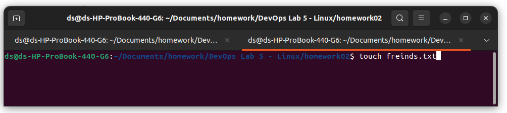

* Open the document in text editor and save using ctrl + x and select y

		$ nano friends.txt

## Exercise 02
### Display the contents of friends.txt on the console. 

		$ cat friends.txt

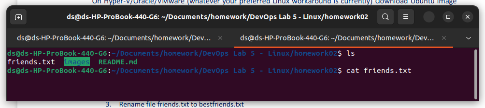

## Exercise 03 
### Rename file friends.txt to bestfriends.txt 

 * To change the of the use command mv
 
 	
        $ mv friends.txt  bestfriends.txt 

 
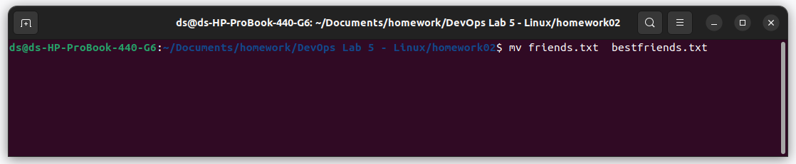

## Exercise 04 
### Make a copy of bestfriends.txt under the name sysadmins.txt

 * Copy bestfriends.txt sysadmins.txt using cp command
 
 	
        $ cp bestfriends.txt sysadmins.txt

 
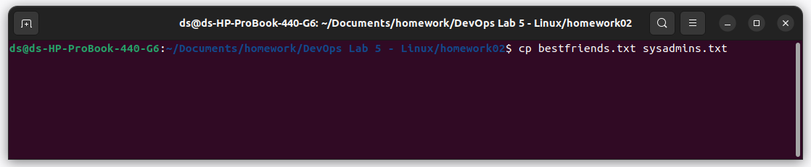

## Exercise 05

### List all files whose name begins with letter 'b' and ends with extension txt. 

    $ ls | grep ^b

 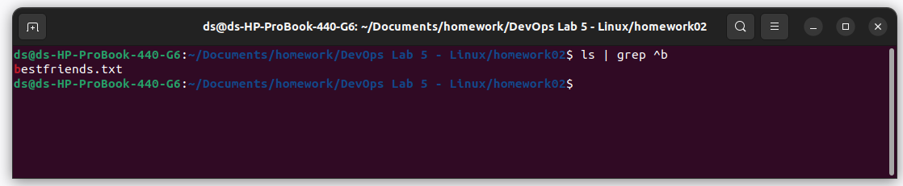

## Exercise 06

###  Write a command that will tell you how many bytes are taken up by file sysadmins.txt 

* we can check the file size using commands 
 
 		    ls -l filename | awk '{print $5}'
            stat -c %s filename
            wc -c < filename

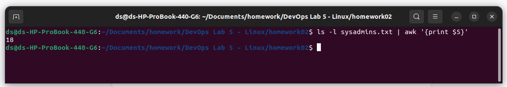

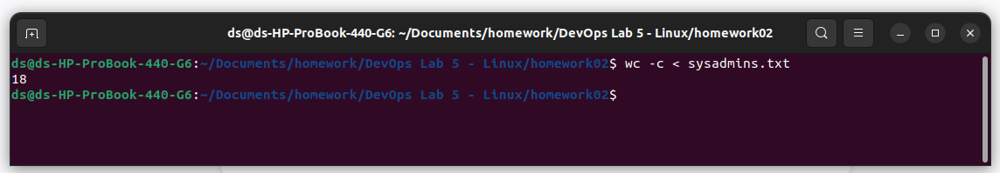

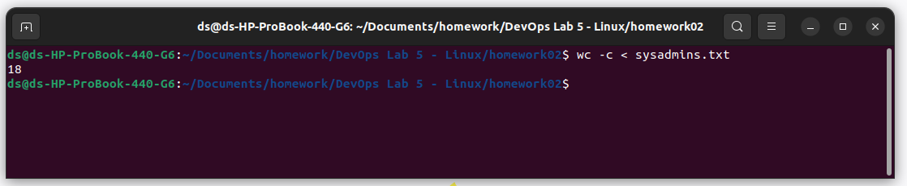

## Exercise 07

###  Create file cars.txt with a list of 5 brands of cars on separate lines. 

* Open terminal and type
 
            nano cars.txt
            touch cars.txt

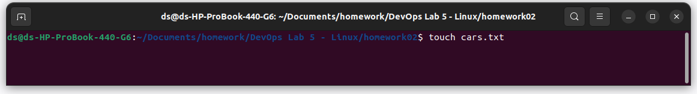

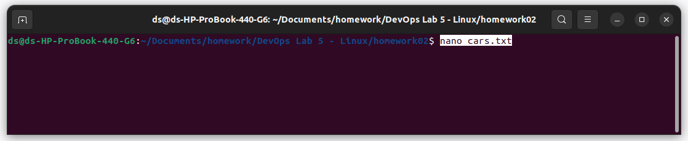

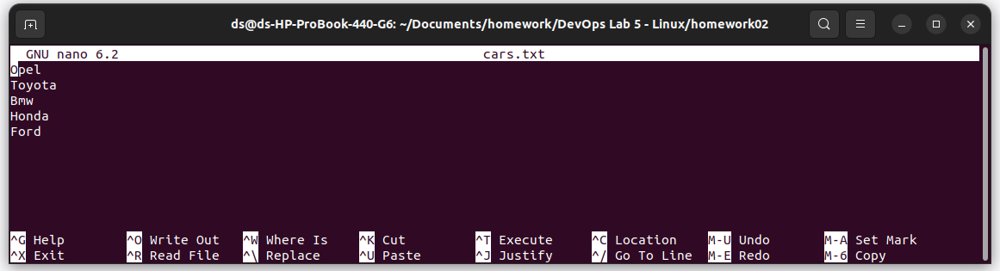

## Exercise 08

###  Check how many bytes are taken up by the file. 

* Open terminal and type
 
            $ ls -l cars.txt | awk '{print $5}'
             

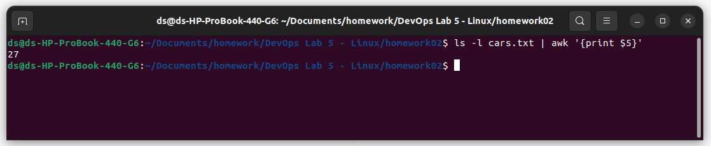

 
 
 ## Exercise 09

###  Copy the file cars.txt into directory /tmp. 

 
            $ cars.txt /tmp/
             

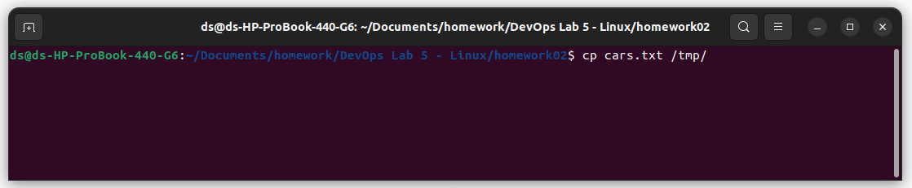
 

  ## Exercise 10

###  List all files with extension *.txt in directory /tmp and verify that the file was copied properly. 

 
            $ sudo find /tmp -type f -name "*.txt"
             

  ## Exercise 11

###  Without leaving your home directory rename file cars.txt located in /tmp to vehicles.txt in /tmp 

 
            $ mv /tmp/cars.txt /tmp/vehnicles.txt
             

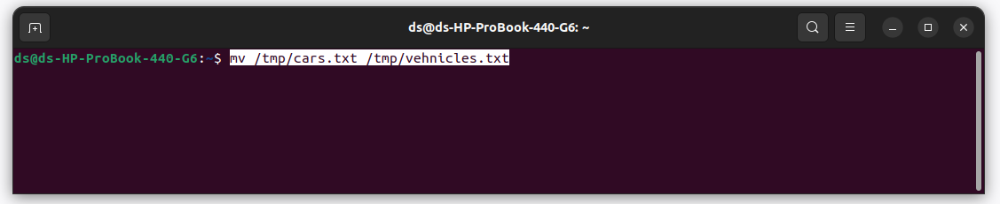
 

 ## Exercise 12

###  Display the contents of /etc/passwd file on the screen interactively (so you can search, scroll up and down). 

            $ less /etc/passwd
             

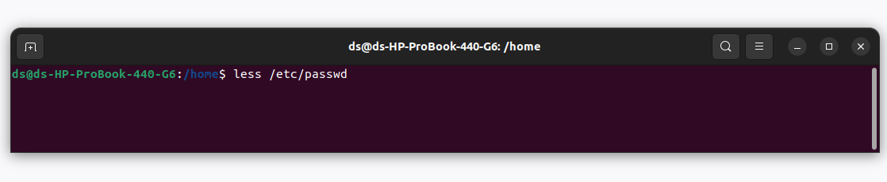

 