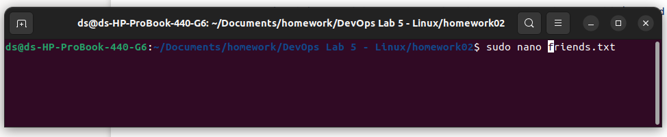

# Exercise: Basic Linux & Bash commands 

### Exercise 01

Create a file friends.txt with a list of names of three of your friends on separate lines. 

* Lets create new file using nano - text editor, open Terminal and type:

        $ sudo nano friends.txt

* Alternativy you can create new file using touch command

		$ touch friends.txt

* Open the document in text editor and save using ctrl + x and select y

		$ sudo nano friends.txt

### Exercise 02
#### Display the contents of friends.txt on the console. 

		$ cat friends.txt

### Exercise 03 
##### Rename file friends.txt to bestfriends.txt 

 * To change the of the use command mv
 
 	
    $ sudo mv friends.txt  bestfriends.txt 

 

 
   