# Exercise: Basic Linux & Bash commands 

## Exercise 01

### Create a file friends.txt with a list of names of three of your friends on separate lines. 

* Lets create new file using nano - text editor, open Terminal and type:

        $ nano friends.txt
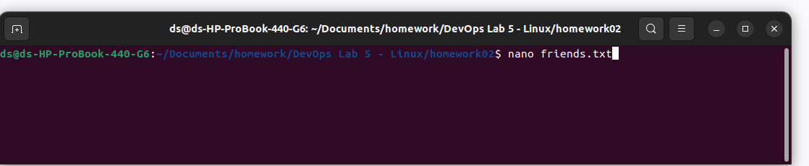

* Alternativy you can create new file using touch command

		$ touch friends.txt

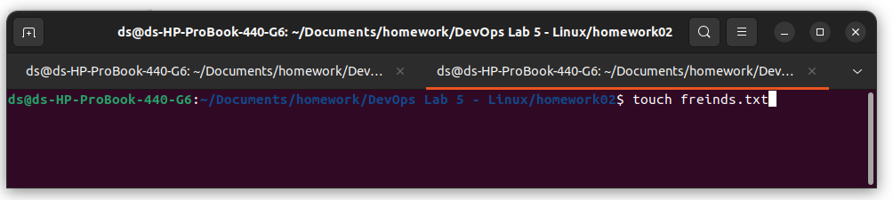

* Open the document in text editor and save using ctrl + x and select y

		$ nano friends.txt

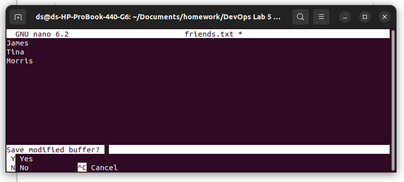

## Exercise 02
### Display the contents of friends.txt on the console. 

		$ cat friends.txt

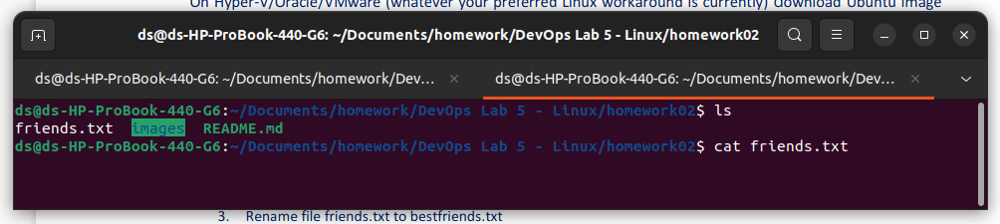

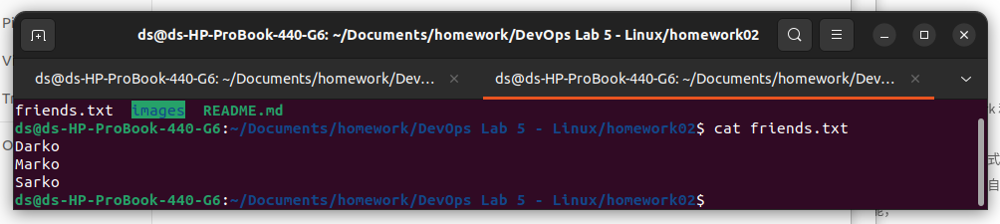

## Exercise 03 
#### Rename file friends.txt to bestfriends.txt 

 * To change the of the use command mv
 
 	
        $ mv friends.txt  bestfriends.txt 

 
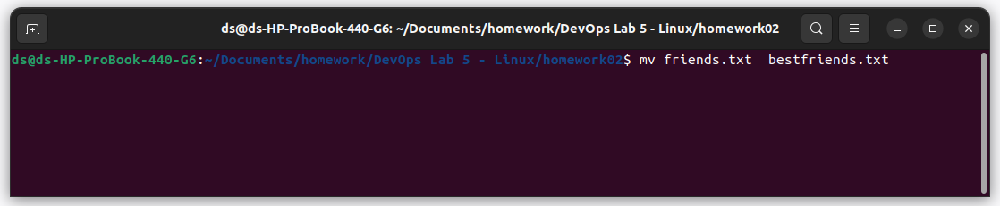

 

## Exercise 04 
#### Make a copy of bestfriends.txt under the name sysadmins.txt

 * Copy bestfriends.txt sysadmins.txt using cp command
 
 	
        $ cp bestfriends.txt sysadmins.txt

 
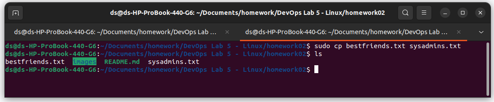

## Exercise 05

### List all files whose name begins with letter 'b' and ends with extension txt. 

    $ ls | grep ^b

 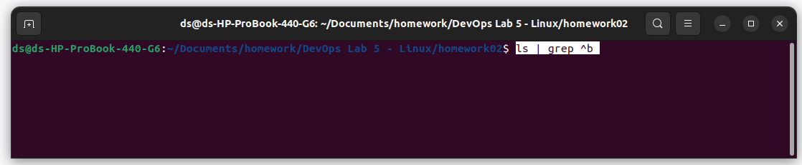

## Exercise 06

###  Write a command that will tell you how many bytes are taken up by file sysadmins.txt 

* we can check the file size using commands 
 
 		    ls -l filename | awk '{print $5}'
            stat -c %s filename
            wc -c < filename

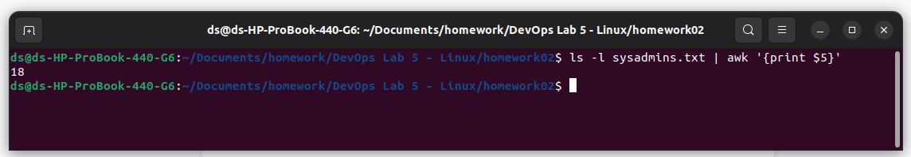

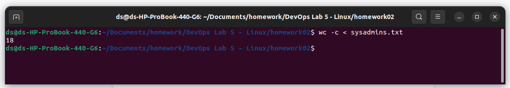

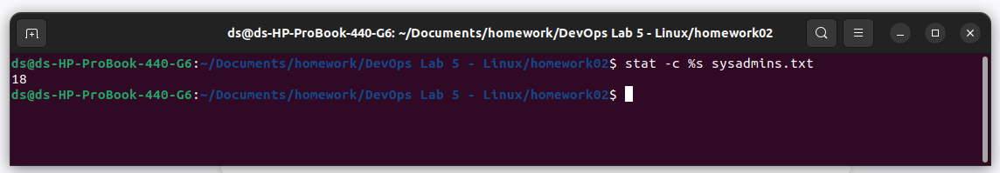

___

## Exercise 07
### Create file cars.txt with a list of 5 brands of cars on separate lines. 

    $ touch cars.txt
    $ nano cars.txt
    

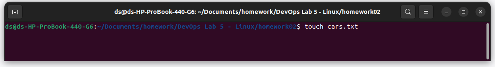

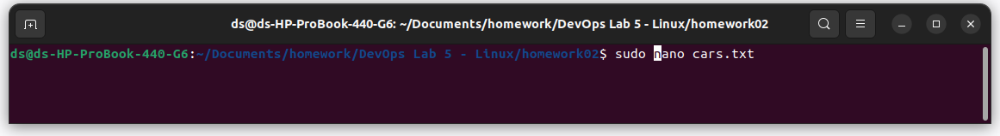

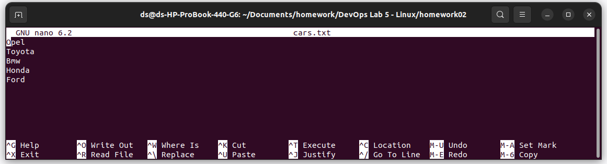

 
