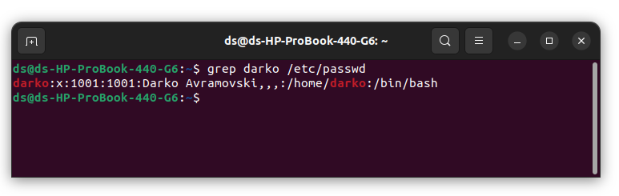
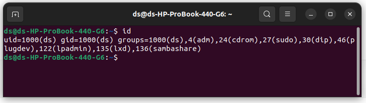
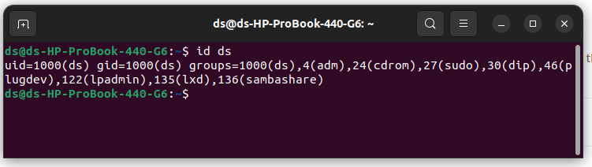
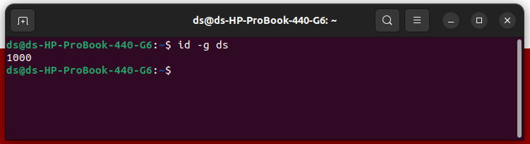

## SF DevOps Academy Homework - Exercise 2: Shell scripts 

##### Elevate your user access to root; 

    sudo -i || sudo -s

##### Add a new user to your Linux OS and set a password for it; 

    sudo adduser userName

##### Test if you can log in using that user; 

    works!!!

##### Using grep command check if the user is created; 

    gred darko /etc/passwd

##### grep the UID of each user; 

    id

    id ds

##### Find out the GID of the created user; 

    id -g ds

##### Change the password of the user and force it to change the pass on his next login; 

##### Add a new user and set an expiration date for it, with a five-day warning period; 

    sudo useradd -e 2023-03-15 ds2

To check expiration date

    sudo chage -l ds2 

##### Create a new group; 

    sudo groupadd sfa

To see all groups in the system

    less /etc/group

##### Assign the two new users to that group; 

    sudo useradd -G sfa ds

##### Lock one of the user accounts; 

    usermod -L ds | passwd -l  ds

##### Change the shell of one user to tcsh;

List all shells

    cat /etc/shells

    grep darko /etc/passwd

    usermod --shell /tcsh darko

##### Make sure your home directory has “execute”access enabled for group and other. 

##### Change to your home directory, and create a directory called labs; 

    sudo usermod -d /Home

    mkdir labs

#### Create an empty file in labs director

    cd labs
    nano labs.txt

#### Change permissions of file to rwx-rwx-rwx

    sudo chown 777 -R /labs

#### List the file. What color is the file? 

#### Change the permissions back to rx-rw-rw

    sudo chown 366 -R /labs

#### Check what owners does the file have. 

#### Change the user ownership of the file to another user; 
#### Create a group called group1 and assign two users to the group; 
#### Create a file called group1.txt and redirect below input into the file: “This is our group test file”. 
#### Change the group of the file to one of your users; 
#### Give members of the group group1 read/write access to this file? 