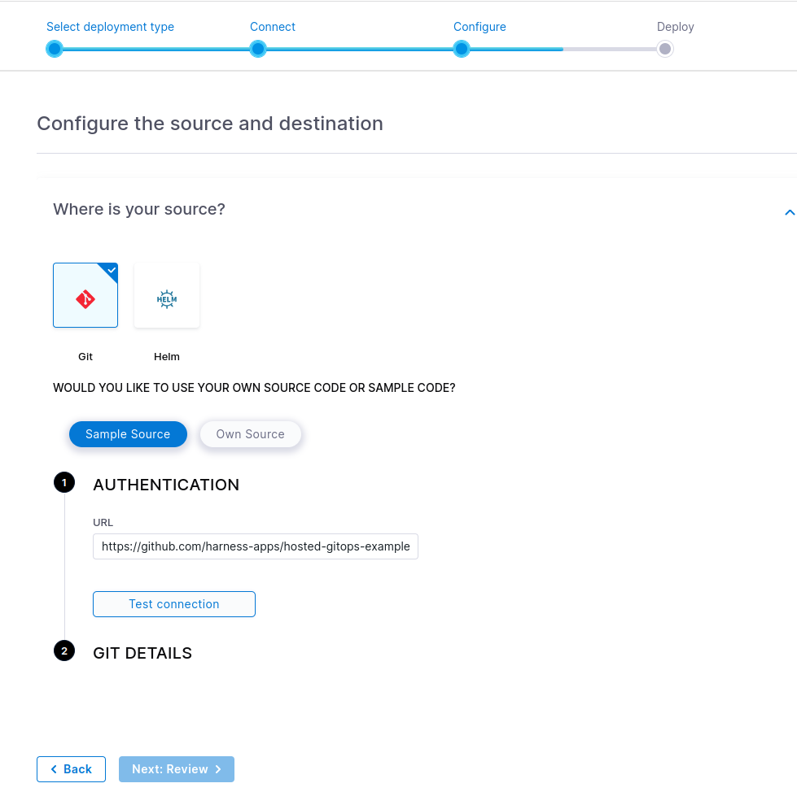
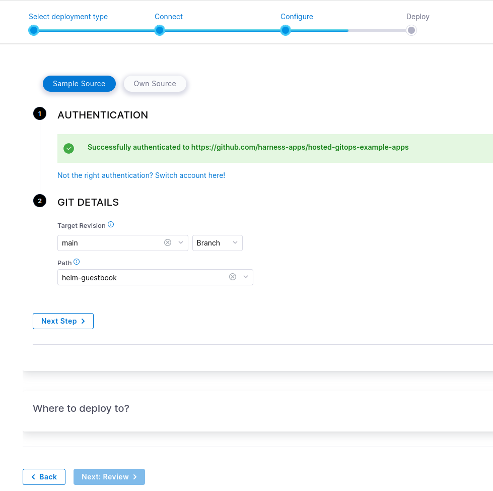
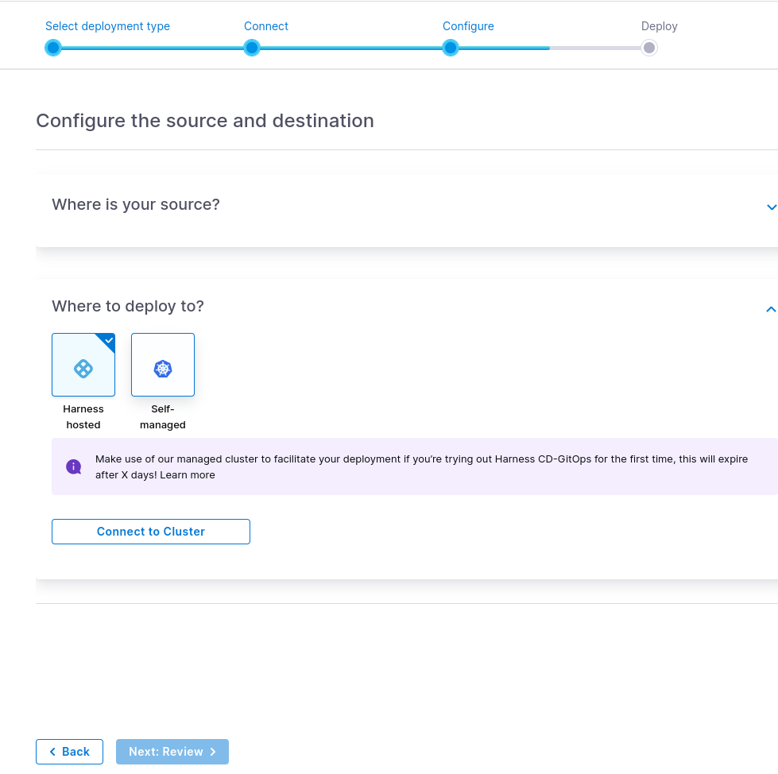
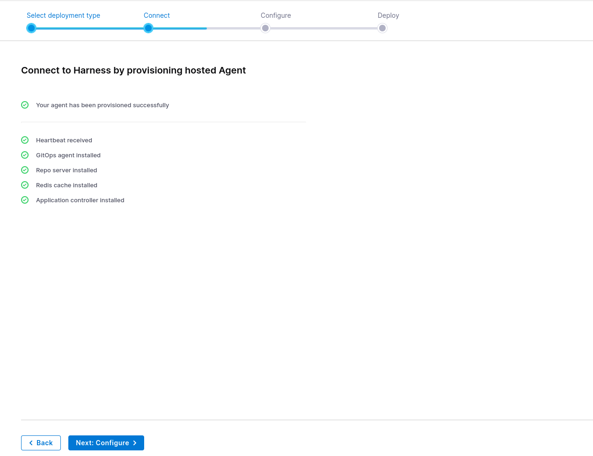
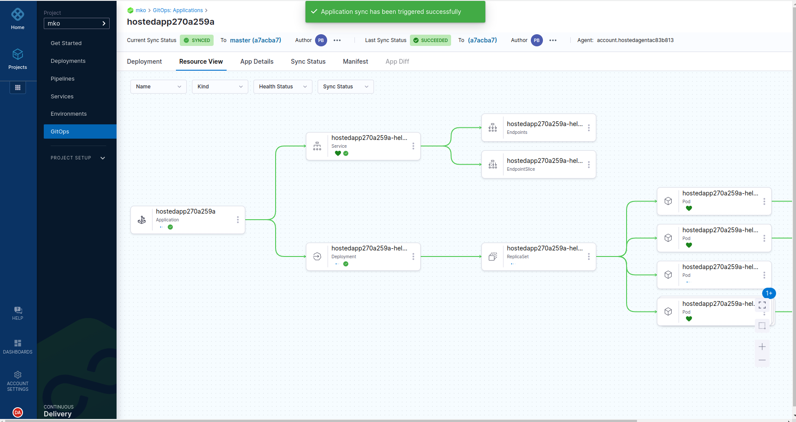

#### Kubernetes GitOps: A Beginner's Guide with a Hands-On Tutorial

For this exercize we are going to use **Harness** we need to create free account. Login ot your aacount and create new project.

After we created the project select deplyoment type shooes **Kubernetes with GitOps**. Connect your repository .

test the connection

Where to deploy to? Select harness hosted and click connect to cluster.

Hext deploy the ans sync the application

