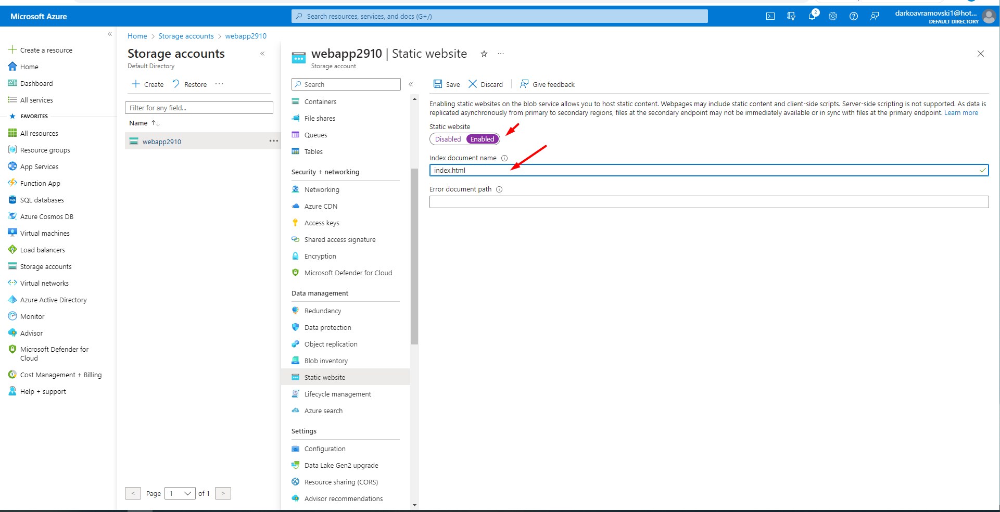

## Mid-Term Task

## Part I

1. Host a static website on Blob Storage: build and deploy a static Hello
World website to Azure Storage.
2. Verify that the default web page has the Hello World! page.
3. Provide the steps and results.

Login to your account in azure.portal navigate to  **Create a storage** > **Create a storage account** 
then click **Create storage account**

 

Fill required detailes **Project details** and **Instance details** and click **Create**

 

Open you storage that you created
 

From the left side menu select **Data management/Static website**

 

On toggle button click **Enable Static website** and fill **Index document name**  ***index.html*** and click on the Save button

 

After we Successfully we creted the static page we can click on **$web** to upload new file 

 

On the next screen click **upload** and new popup windows from the right side will apear select the file that we created  ***index.html*** and click upload 

 

Navigate back to Static website select storage account / static website from the left side menu and copy **Primary endpoint**

 

Verify that the static web page is working.

 

## Part II

In this exercise we will setup a Linux based web server and will
deploy a web page on it.
1. Create a Virtual Network where you will deploy your Linux Based
Web Server.
2. Modify the network security group for your virtual machine that will
allow you to remotely manage your machine only from your local
machine and nowhere else.
3. Create a Linux Virtual Machine that will be your Web Server which is
publicly available for web publishing (not SSL) only from your
machine and nowhere else.
4. Connect to the VM.
5. Install Apache Web Server.
6. Deploy the “Hello World” web page.
7. Provide Testing from your cellphone.
8. Provide the steps and results.

Login to your account, in the search bar type **Virtual networks** open virtual network and click create new virtual network now we are going to create new virtual network

 

on the next screen fill required fields

* Subscription: Choes Subscription
* Resource group: Select resource group or create new one
Instance details
* Virtual network name: Type virtual netwotk name
* Region: Select Region

 

Click next Secuirty tab will apear click Next **IP addresses** delete default address space that already appears.

 

Click on the button Add an IP address space, and new window we apear on the right side on the screen and fill the address space for new Ip address

 

