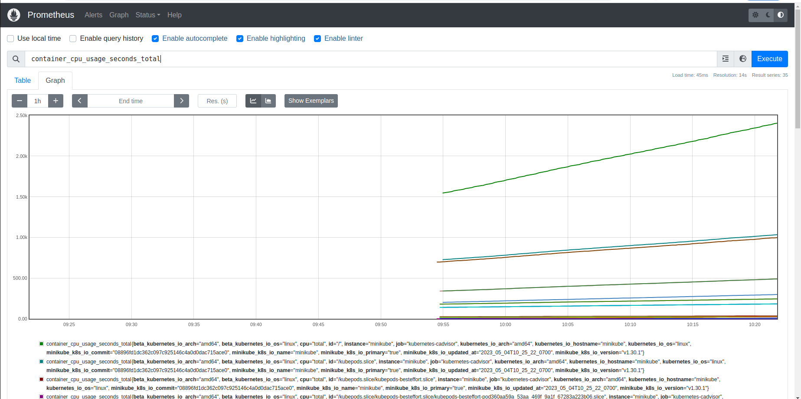

### Create a Namespace & ClusterRole

First we need to created namespace for our monitoring using the following command, after we start the minikube

    minikube start

create new namespace using 

    kubectl create namespace monitoring

To start the dashboard for kubernetis cluster run **minikube dashboard** and navigate to **Cluster / Namespaces** and we can see that the namespace that we create.

     

To verify that namespace **monitoring** is created in command line type:

   kubectl get namespaces

     

Now lets create new file caled **clusterRole.yaml** 
Note: In the role, given below, you can see that we have added ***get, list, and watch*** permissions to nodes, services endpoints, pods, and ingresses. The role binding is bound to the monitoring namespace. If you have any use case to retrieve metrics from any other object, you need to add that in this cluster role.

**clusterRole.yaml** 

    

run the following command to create the role

    kubectl create -f clusterRole.yaml

    

## Create a Config Map To Externalize Prometheus Configurations

All configurations for Prometheus are part of prometheus.yaml file and all the alert rules for Alertmanager are configured in prometheus.rules.

***prometheus.yaml:*** This is the main Prometheus configuration which holds all the scrape configs, service discovery details, storage locations, data retention configs, etc)

***prometheus.rules:*** This file contains all the Prometheus alerting rules

Lets create new file **config-map.yaml** with the following content [config-map.yaml](https://raw.githubusercontent.com/bibinwilson/kubernetes-prometheus/master/config-map.yaml) and excute ***kubectl create -f config-map.yaml*** this command will create two new file ***prometheus.yaml:***  and ***prometheus.rules:*** 

    kubectl create -f config-map.yaml

    

The prometheus.yaml contains all the configurations to discover pods and services running in the Kubernetes cluster dynamically. We have the following scrape jobs in our Prometheus scrape configuration.

* **kubernetes-apiservers:** It gets all the metrics from the API servers.
* **kubernetes-nodes:** It collects all the kubernetes node metrics.
* **kubernetes-pods:** All the pod metrics get discovered if the pod metadata is annotated with prometheus.io/scrape and prometheus.io/port annotations.
* **kubernetes-cadvisor:** Collects all cAdvisor metrics.
* **kubernetes-service-endpoints:** All the Service endpoints are scrapped if the service metadata is annotated with prometheus.io/scrape and prometheus.io/port annotations. It can be used for black-box monitoring.

## Create a Prometheus Deployment

Let`s create new file called **prometheus-deployment.yaml** with the following content.

   

Run the command ***kubectl create  -f prometheus-deployment.yaml***  to create the deplyoment

    kubectl create  -f prometheus-deployment.yaml 

   

You can check the created deployment using the following command or you can check also ***from minikube dashboard.***

    kubectl get deployments --namespace=monitoring

   

### Minikube dashboard

   

## Connecting To Prometheus Dashboard

1. First get the pods name
   
    kubectl get pods --namespace=monitoring

  

2. execute the following command to start monitoring dashboard - replace with your pod name.
   
   kubectl port-forward ***prometheus-deployment-954488b65-flglb *** 8080:9090 -n monitoring

  

You can open you browser to **http://localhost:8080** and view the dashboard

  

### Method 2: Exposing Prometheus as a Service [NodePort & LoadBalancer]

To access the Prometheus dashboard over a IP or a DNS name, you need to expose it as a Kubernetes service.

#### Step 1: Create a file named **prometheus-service.yaml** and copy the following contents. We will expose Prometheus on all kubernetes node IP’s on port 30000.

    apiVersion: v1
    kind: Service
    metadata:
    name: prometheus-service
    namespace: monitoring
    annotations:
        prometheus.io/scrape: 'true'
        prometheus.io/port:   '9090'
    spec:
    selector: 
        app: prometheus-server
    type: NodePort  
    ports:
        - port: 8080
        targetPort: 9090 
        nodePort: 30000

#### Step 2: Create the service using the following command.

    kubectl create -f prometheus-service.yaml --namespace=monitoring

  

  

